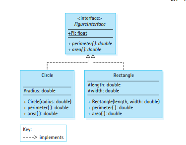
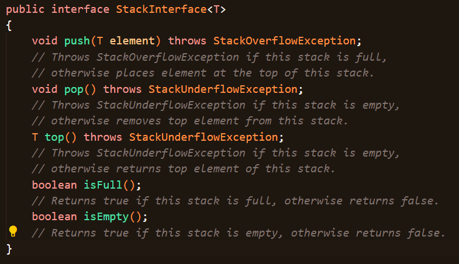
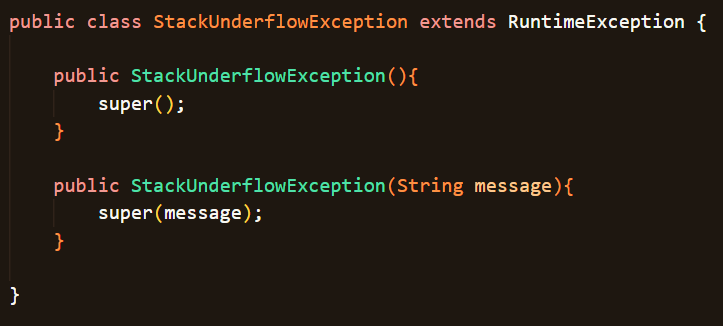
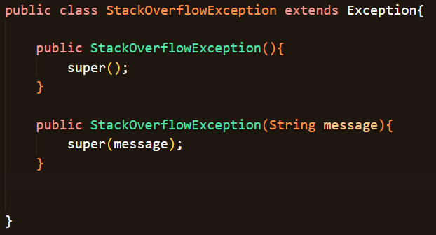
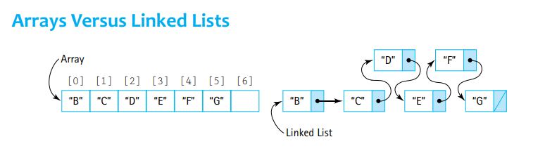
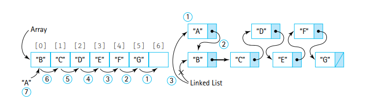
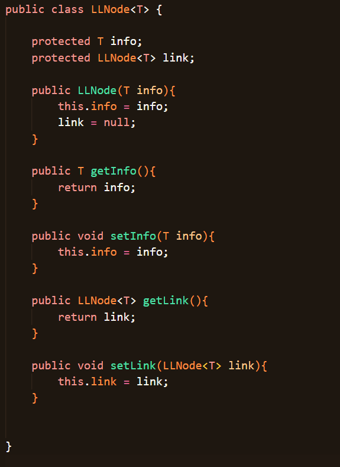
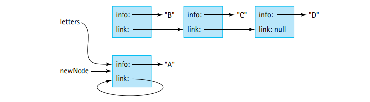
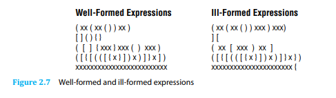
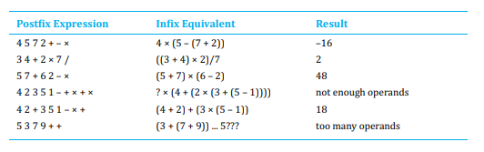

# Stack ADT
---
## Abstraction
- An	**abstraction**	is	a	model	of	a	system	 that	
includes	only	the	details	essential	to	the	perspective	of	 the	 viewer	of	 the	system.	
- **Information hiding**	is	the	practice	of	hiding	details	within	a	module	with	the	goal	
of	simplifying	the	view	of	the	module	for	the	rest	of	the	system.

Although integers are strored as a set of 32 bits within a computer, a Java programmer does not need to focus on this information to utilize the abstraction of an integer which Java provides.

- **Data encapsulation**	is	a	programming	language	 feature	 that	 enforces  information	 hiding,	 allowing	 the	 internal	
representation	of	data	and	the	details	of	the	operations	on	the	data	to	be	encapsulated	together	within	a	single	construct.

You	can	think	of	the	data  and	the	operations	in	a	logical	sense	and	can	consider	their	use	without	having	to	worry	
about	 implementation	 details.

- An	**abstract data type (ADT)**	is	a	data	type	whose	properties	(domain	and	operations)	are	specified	independently	of	any	particular	implementation.**In	effect,	all	of	 Java’s	built-in	 types,	such	as	int,	are	ADTs.**

Different users observe the data at varying complexity levels. 

These levels of abstraction can loosely be split in to **application (client / external) level, abstract (logical) level, and implementation (internal) level understandings.**

- In	this	section,	which	features	abstraction,	
the	focus	is	the	abstract	level.

- For	the	most	part	the	**abstract	level	provides	independence	between	the	application	and	implementation	levels.**	Keep	in	mind,	however,	that	there	is	one	way	that	the	implementation	details	can	affect	the	applications	that	use	the	ADT—in	terms	of	efficiency.

- **Preconditions**	 of	 a	method	 are	 the	 conditions	 that	must	 be	 true	when	invoking	 a	
method	 for	 the	method	 to	work	correctly.
- **Postconditions** (effects)	of	a	method	are	the	results	expected	at	the	exit	of	the	method,	assuming	that	the	preconditions	were	met.	Postconditions	do	not	tell	us	how these	results	
are	accomplished;	they	merely	tell	us	what the	results	should	be!

Ex. 

`public void increment()`

`// Preconditions: Values of day, month, and year represent a valid date.
// The value of year is not less than MINYEAR.
//
// Increments this IncDate to represent the next day`

## Interfaces

In	 Java,	 the	 word	 **“interface”**	 has	 a	 very	 specific	meaning.	 

- **It	can	include	variable	declarations	and	methods.	However,	all	variables	declared	in	an	interface	must	be	constants	and	all	the	methods	must	be	abstract, default, or static.**
- An abstract method includes the description of its parameters but has no body.

- Java interfaces can not be instantiated, i.e. **you cannot make objects from interfaces.** Instead, interfaces serve as template that other classes can fit into. **They describe the requirements for other classes.**

- Interfaces are compiled into .class files just like other traditional classes.

- Interfaces are used by **implementing** them. Many classes can implement the same interface!

Ex. 

`public class Circle implements FigureInterface`

`public class Rectangle implements FigureInterface`

- Dashed arrows in a UML model indicate an **implements** relationship between an interface and the classes that inherit it!

Ex.

## Why use intefaces?

1) We can check the syntax of our specifications. The compiler will show us any syntactical errors in the method interface definitions that were placed in the child class that implements the interface.
2) We can check that the syntactical part of the interface contract is satisfied by the implementation. The compiler will ensure that the method names, parameter types, and return types of the methods in the child class match those defined in the interface.
3) We can define one interface for multiple, alternative implementations of the same Abstract data type that prioritize different functionalities. At their core, all these implementations will share a common interface. Ex. Some implementations may prioritize speed, others might prioritize memory allocation. **An implementation may add extra functionality beyond the scope of the interface, BUT it will always at minimum need to satisfy the requirements of the interface.**

## Interface based polymorphism

Although we cannot create objects with interfaces, we can still allocate memory based on the interface type, then fill up those slots with concrete objects.

ex.

`FigureInterface[] figures = new FigureInterface[10];`

`figures[0] = new Circle(1.0);`

- An interface can act as a polymorphic reference slot. But the objects that go into the slot must be concrete.

## The Stack

- A **stack** is an	ordered	group of homogeneous elements. The removal of existing elements and the addition of	new	ones can take place	only at	the	top	of the stack
- It is a **LIFO (last in, first out) structure**.	A stack is an	access-controlled structure	in which elements **are added	or removed from	only one end**, a LIFO	structure.

Operations on a stack include **push, pop, and top (peek)**.
- The push operation allows us to add an element to the top of the stack.
- The pop operation removes the element at the top of the stack
- The top (peek) operation returns the value at the top of the stack, without actually changing the stack.

Practical applications of the stack:
1) 	Programming	language systems typically use a stack to keep track of	operation calls. The main program calls	operation A, that in turn	
calls operation	B, that	in turn	calls operation	C. When	C finishes,	control	 returns to	B, the	postponed obligation; when B finishes, control	returns	to	A, the previous	postponed obligation; and so on. **The call and return	sequence is	essentially	a LIFO sequence	of postponed obligations.**

2) An operating	system will save information about the current	executing	process	on	a	stack	so	that	it	can	work	
on	a	higher-priority	interrupting	process

3) Compilers use stacks	 to	 analyze	 language	 statements.	 A	 program	 often	 consists	 of	
nested	components,	for	example,	a	for loop	containing	an	if-then statement	that	contains	a	
while loop.	As	a	compiler	is	working	through	such	nested	constructs,	it	“saves”	information	
about	what	it	is	currently	working	on	in	a	stack;	when	it		inishes	its	work	on	the	innermost	
construct,	it	can	“retrieve”	its	previous	status	(the	postponed	obligation)	from	the	stack	
and	pick	up	where	it	left	off.

How should we approach implementing a stack?

---
- One	approach	to	creating	generally	usable	collections	is	to	**have	the	collection	ADT	hold	
variables	of	class	Object.**	**Because	all	Java	classes	ultimately	inherit	from	Object.** 

- Drawback of that approach: **Whenever an element is	removed	from	the	collection,	it	can	be	referenced	only	as	an	Object.**	If	
you	intend	to	use	it	as	something	else,	you	must	cast	it	into	the	type	that	you	intend	to	use.

Ex.

`collection.push("Kalpesh");`

`String name = (String) collection.top();`

`System.out.println(name);`

- We need to cast whenever we return objects from an Object based stack collection, if we want to perform proper operations on the object.

---

- We can use interfaces to ensure that particular objects have common methods, and then we can use the interface to define the Stack.

Ex. If three objects are all implementing the Comparable interface then:

`Stack<Comparable> myStack = new Stack<Comparable>()`

If you want to see an actual strategy that uses this type of collection, look up Abstract Factory Design Pattern.

---
- **Generics**	allow	us	to	pass	type	names	such	as	Integer,	String,	or	BankAccount as	arguments.	Notice	the	subtle	difference:	with	generics	**we	actually	pass	a	type,	for	example,	String,	instead	of	a	value of	a	particular	type,	for	example,	“Elvis.”**

- We	can	define	a	collection	class,	such	as	Stack,	as	containing	
elements	of	a	 type	T,	where	**T	is	a	placeholder	 for	 the	name	of	a	 type.**

---

## The Stack Interface
- The stack interface

- The exceptions

Remember, we cannot actually create a collection with an interface, **we need a concrete class that implements the interface's contract.**

- The interface contains requirements for the push, pop, and top methods alongside the exceptions they might need to throw based on the state of the stack.

- The isFull and isEmpty methods will be used internally in other methods to know when to throw exceptions and could also be called outside of the Stack class by the user to determine the state of the stack.

Among the files in this folder there are 3 implementations of the Stack:
- **Array Bounded Stack**
- **ArrayList Stack**
- **Link Based Stack**

## Array Bounded Stack
---
### Instance variables and Constructor
- The stack will be internally stored as an array of elements of type T.

`protected T[] elements;`

- The capacity of the implemented list can be provided via the constructor, or if not also has a default capacity of 100 elements;

`protected final int CAPACITY = 100;`

`elements = (T[]) new Object[CAPACITY];`

OR

`elements = (T[]) new Object[maxSize];`

where maxSize is provided via a constructor paramater.

- To determine if the array is full or empty, we will have to move some sort of pointer to track our current top of stack. Initially when the stack is empty, this pointer will be set to -1. And the pointer will increment for every pushed element, and decrement everytime an element is popped off.

` protected int topIndex = -1;`

### isEmpty() and isFull()

- **If the topIndex pointer is at -1 at any given point we know that the Stack is empty!**

- **If the topIndex pointer is equal to n-1, where n is the capacity of the array, we know that the array of elements is filled up!**

### push(), pop(), and top()

- We can push onto the stack if it is not full, which we can check by calling the isFull() method. When we add to the stack, we first want to iterate our pointer, then add the element at that position.

-  **Why not do it in reverse? Set the element and then increment? Well because, although that strategy is viable, it would not work with our implementation.**
  
-  Ex. If we are at the n-1th index based on the topPointer, we know we are full. In other words, **the topIndex is pointing to a filled element**, since the element at n-1 must be occupied (since the array is filled)! **We could have implemented the stack such that the topIndex always points to the first unoccupied spot in our stack, but we did not choose that path!**

- We can pop elements from the top of the stack by simply setting the element at the top of the stack (at the topIndex) to be null and then decrement our topIndex to reflect the new top of the stack. **Remember this should only work if the array is NOT EMPTY, otherwise we throw an exception.**

- To implement top() we simply return the value at the topIndex. **Remember this should only work if the array is NOT EMPTY, otherwise we throw an exception.**

## ArrayList Stack
---

### Instance variables and Constructor
- An ArrayList based implementation is much simpler, since the "top" of an ArrayList can easily be retrieved using the .size() function!

- The only instance variable we need is the arraylist itself, in which our elements will be stored.

`protected ArrayList<T> elements;`
- We do not need to define a size via the constructor because an ArrayList object grows dynamically.

### isEmpty() and isFull()
- **An ArrayList can grow to any needed size, so a stack based on an ArrayList can never be full. isFull() should ALWAYS RETURN FALSE.**

- The Stack will only be empty if the size of the ArrayList is 0, which indicates that there are no elements in the ArrayList. The method **isEmpty() will return true if the size of the alements ArrayList is equal to 0.**

### push(), pop(), and top()
- We can always push an element onto the Stack by simply calling the .add() function on the underlying ArrayList. **An ArrayList is never full so we can keep calling push() without limits.**
  
- We can pop an element by removing the element at the n-1th position in the ArrayList. In other words, we can call the remove() method of the ArrayList on the element at index size-1. **Remember this should only work if the array is NOT EMPTY, otherwise we throw an exception.**

- To implement top, we simply call the .get() method of the ArrayList to get the size-1'th element of the ArrayList and then return that element. **Remember this should only work if the array is NOT EMPTY, otherwise we throw an exception.**

## Linked List Based Stack
---
- This section is crucial. We will first understand what linked lists are!

- In a traditional array we represent all the elements as being grouped together and sitting in one block of memory.
- In a linked list, each element sits in its own **node**.
- A **node** is a small separate block of memory.

- In an array we can access any given element by specifing its index, **the time complexity of accessing the index is constant** as we simply find it in memory.

- However, within a linked list, elements in the list must be access sequentially. Each node points to the next node, **so to get to node N, you have to traverse the N-1 nodes that come before it! The time complexity of this operation is O(n) in the worst case**

### So then why the fuck would we use a linked list?

- The size of an array is fixed, whereas the size of a linked list can be changed whenever we need more memory to store more nodes. **Anytime we no longer need a node, we delete it by deallocating and freeing up memory. Anytime we need to add another node, we simply allocate a bit more memory.** Whereas an array still keeps a constant reserved block of memory no matter if its full or empty.

- **Some specific operations are more easier to perform with linked lists.** Obviously it is more complicated to search for elements with a linked list. But however, **the task of adding elements to the front (before the first element) of the list is much more efficent with a linked list structure** compared to a traditional array.

Illustration:

- For a traditional array we would need to shift up the indexes of all other elements by one before inserting an element to the front of the structure.
  
- For a linked list we can simply make a new node, and then make that node point to the first element of the original linked list, and then make the new node the root (starting point) of our structure. **All that needed to be done was: create a node and update two links between nodes** (a new link between the root and A, and then a link between A and B).

- **For some use cases you will never have to directly access a node deep within the structure** without first accessing the nodes that precede it. **In these situations, the sequential searching speed will not adversly affect day-to-day performance.**

### Making the Linked List Structure

- **The individual blocks of a linked list are NODES, get used to seeing this word a lot. Because the same general idea of a node is repeated all over this course and many others that build on it!**

LinkedList Node class:

The structure of Linked List Node is pretty straightforward.
A node has two defining features
- **Its data / info,** which is the information that a node holds which is based on the type of the instantiated node.
- **Its link,** which is the pointer to another node of type T that this node links up with. This is what makes Linked Lists a sequential structure. Each node points to the node after it!

### Operations on a Linked List
---
The LLNode class is a building block for us to create Linked Lists! LinkedLists are basically a sequence of these type of nodes. 
- **Three basic operations:** We can add or remove nodes from a LinkedList, or we can traverse through these nodes.

To traverse through a linked list in its entirety, **we need some sort of while loop, that checks if the node that we are on is null.** 

If we iterate through all the nodes and come upon a link that is null, and then say

`current = current.getLink()`

Then we know that the **new current node will be null value**, and when that occurs we know we have hit the end of our Linked List. **A Linked List terminates when the link of the node we are on points to nowhere (null).**

Pseudocode:

    while(current != null):
        print(current.getInfo); \\ Printing the value we are on.
        current = current.getLink;

To insert elements into a LinkedList we also need a loop of sorts and then we need to carefully manipulate our references!

- To begin **lets just think about how we would insert an element to to the beginning of a linked list!**

Lets say that **the variable linkedList points to the first node** in the sequence. **In other words this variable is our root / base.**

To insert an element here, **we need to create a node and then make it link to the root**, such that it comes before the root. **And then we need to redefine the root so that it points to the new node's address.**

Pseudocode:

    newNode.setLink(linkedList);
    linkedList = newNode;

**THE ORDER OF THE STATEMENTS IS CRITICAL.**
- If we reversed the order then the insertion would fail. If we redfined the root first and then changed the link to point to the new root we would have a link that points to itself! Try drawing this out.

To illustrate the failure:

- Inserting into the beginning of the Linked List is easy enough, but inserting into any point of the linkedList is only slightly more complicated.

### **Everything below is additional info not covered in this chapter, until I mention otherwise!**

Pseudocode:

    // Inserting as the 4th element in the linked list
    current = linkedList // Current is initialized to root (first element)

    for(int i = 0; i < 2; i++):
        current = current.getLink();
    
    // After the loop, current will be at the third element in the list

    temp = current.getLink(); 
    // We will store the 4th element

    newNode = new LLNode("SOME VALUE", temp); 
    // We will make our new Node point to the 4th element (temp)
    
    current.setLink(newNode);
    // We will make our third element point to the newNode, which itself points
    // to the original 4th element. This means our newNode is at position 4 
    // (index 3) while the original 4th element was shifted up alongside any
    // elements the follow it.

To delete elements from a stack the methodology is similar to insetion! We just need be careful with our links.

- To begin **lets just think about how we would delete an element from the beginning of a linked list!**

To delete an element here, **we need to simply redefine the root to point to the second element of the linked list, which means it will effectively skip over the first Node and cut it out from the sequence entirely.**

Psuedocode:

    linkedList = linkedList.getLink();

- We do not care about prior elements because we know we are just redefining from the front of the list.

- Deleting from the beginning of the Linked List is easy enough, but deleting from any point of the linkedList is only slightly more complicated.

Pseudocode:

    // Deleting the 4th element in a linked list.
    current = linkedList // Current is initialized to root (first element)

    for(int i = 0; i < 2; i++):
        current = current.getLink();
    
    // After the loop, current will be at the third element in the list.
    
    temp = current.getLink().getLink();
    // Temp points to the 3 + 2, 5th element in the list.
    
    current.setLink(temp);
    // We set the 5th element as the one that comes after the third element,
    // effectively remove the 4th element from the chain!

### **Uneccesary section over, lets get back to some useful stuff!**

### Actually coding the Linked List Based Stack
---
### Instance variables and Constructor
- For a Linked List based stack the only thing we need to keep track of is the node at the top of the stack, this will point to the remaining elements in the stack sequentially.

` protected LLNode<T> top`

- We could construct the Stack with no initial node, or we could provide a value of type T which we would use to create our initial top of the stack.

### isEmpty() and isFull()
- A link based stack should always have something at its top value, but if the top is null,
then we would know that the stack is empty! The method **isEmpty will return true if the top node is null.**
- A linked list based stack can keep growing without limits so the **isFull method should always return false since there is no upper limit to how many elements we can push on to the stack.**

### push(), pop(), and top()
- Pushing onto the stack requires us to first **make a new node based on the given element, then to link the new node to the current top of the stack, and then redefine the top of the stack to be the newNode.**
  
        LLNode<T> newNode = new LLNode<T>(element);
        newNode.setLink(top);
        top = newNode;

- Popping an element from a stack simply requires us to redefine the top of the stack to skip over the current top of the stack and remove it from our chain. **Remember this should only work if the array is NOT EMPTY, otherwise we throw an exception.**

        top = top.getLink();

- If we simply wanted to return and determine what the top element was, we would do the following. **Remember this should only work if the array is NOT EMPTY, otherwise we throw an exception.**

        return top.getInfo();

## Comparing Stack Implementations
- The implementations of isFull	and	isEmpty	are	clearly	O(1); they always take a constant	
amount of work.

- Ask yourself, does the number of elements in the stack matter when it comes to pushing stuff onto the top of a stack or viewing / popping an element off the top of a stack? No, you always operate on the top of the stack is already easily defined for you. **There is no reason to go through the stack since all operations work on the top of a stack, therefore all operations (push(), pop() and top() ) are O(1) complexity.**

- The only significant complexity difference occurs in the constructors between the implementations.
- In array based implementations, the array of n values is instaniated and filled with nulls. **Since this takes n insertions, the array-based stack class constructor has a complexity of O(n).**
- For the linked list approach, instantiating the stack only requires the creation of a single node, a single chunk of memory. **More memory is allocated or deallocated when needed, but since only one node is created by the constructor, we say that the linked-list based stack class constructor has a complexity of O(1).**

Which implementation is better?: It depends!
  
- **For memory efficency, and no upper limit on memory usage, the linked list implementation is better since you do not have a predefined capacity and the memory is managed on a need to use basis.**

- For when the maxmimum size is known with certainty and is relatively small, the array-based implementation is more intuitive and executes faster.**Why does it work faster? Because with a fixed size, you avoid the small time overhead required to allocate memory on every push that occurs with a linked list implementation.**

## Applications: Balanced Expressions
---
- Expressions which are properly matched are known as well formed or balanced equations.
- For every "(" there is a ")".

(((+)))
or 
+++++
or
(xx(xx())x)

- We can think of each of these expressions as postponed obligations. In other words, if we encounter a "(" we know we'll need a matching ")" somewhere later in the code.

- Given	a	set	of	grouping	symbols,	**our	problem	is	to	determine	whether	the	open	and	
close	 versions	of	each	symbol	are	matched	correctly.**

An expression may be ill-formed in two ways. 
- The corresponding closing symbol is not found.
- The corresponding closing symbol is a mismatched closing symbol (i.e. "(x}").

- We need two sets to hold opening symbols ("([{") and closing symbols (")]}").

Preconditions: 
- **We need to ensure that the symbols in each set are unique and the sizes of the two sets should be identical.**

Pseudocode:

        isBalanced = true;
        Stack<Integer> stack = new Stack<Integer>();
        i = 0;
        while( isBalanced &&  i < expression.length()){
            char value = expression.charAt(i);
            openIndex = openSet.indexOf(i);
            if(openIndex != -1){
                stack.push(openIndex);
            }

            else{
                closeIndex = closeSet.indexOf(i);
                if( closeIndex!= -1 ){
                    try{
                        openIndex = stack.top();
                        stack.pop();
                        if(openIndex != closeIndex){
                            isBalanced = false;
                        }
                    catch(StackUnderflowException e){
                        isBalanced = false;
                        }
                    }
                }
            }
        }

Check the Balanced class for the actual implementation! The BalancedTest class contains code that may be an actual application of the class.

## Applications: Postfix Expressions
---
- Traditional mathematical expressions are also known as **prefix expressions**. With these expressions the operators (+, - , /, *) come between the operands.
- **With postfix expressions, the operators come after (post) the operands.**

Prefix:

        prefix              postfix equivalent
        5 + 3               5 3 +
        6 / 2 + 5           6 2 / 5 +

Ex. 

`6 2 / 5 +`

We evaluate the postfix expressions from left to right.
- The first item is a 6, an operand
- The second item is a 2, an operand
- The third item is a divison operator **which we apply to the first two operands. The most recent item is the divisor!**
- **6 2 /   simplifies to 6 / 2 = 3. We substitute the 3 back into the equation.**
- `3 5 +`
- Now we continue scanning, **the next item is a 5 which is an operand.**
- The next and last item is **an addition operator which we apply to the previous two operands: 3 and 5 to obtain a result of 8.**

Here are some postfix operations that may or may not work properly based on the number of operands vs the number of operators provided:

Illustration:

The on-hand algorithm can be a guideline for the approach the computer should take to evaluating postfix expressions.

- Items on the stack can be operands or operators.
- When t**he item we encounter is an operator, we apply it to the 2 preceding operands.**
- We can use a stack to store previously scanned operands. A stack is ideal because the top item is always the most recent operand and the next item down is the second most recent operand.

Pseudocode:

    while(item != null):
        get item
        if(item is operand):
            stack.push(item)
        else:
            operand2 = stack.top()
            stack.pop()
            operand1 = stack.top()
            stack.pop()
            Calculate result based on operator
            stack.push(result)
    
    result = stack.top()
    stack.pop()
    return result

If the program above needs to be implemented, we should also worry about exceptions based on whether or not the stack is empty or full at any given time.

The implementation of the PostFixEvaluator class's method can be seen in another file.

NOTE: **My implementation returns a printed statement along with a result of -1 any time there is an error. This is not optimal if you want to use this code in practical applications but it works nonetheless.**
