# The Queue ADT

If stacks were LIFO (Last in, First out) structures then you can think of 
- **queues as FIFO (First in, first out) structures.**
- **Arrays or linked lists can be used to implement queues.**
- We will explore how to use arrays to created **unbounded queues** as well.
- **Queues may also be applied to safely take advantage of parallel execution within Java to improve performance!**

## The Queue

A queue is an access-controlled group of elements in which new **elements are added from the "rear" and elements are removed from the other end, the "front".**

- Use case: simulate cars passing through various stages of a car wash. Cars go in one end and come out the other end. **The first car to go in will be the first car to come out!**

### Operations of Queues

- **Enqueue**: adding element to rear of the queue.
- **Dequeue**: removing element from front of queue.

The enqueue operation is sometimes simplified to *enq* or called **enque, add, or insert**. Whereas the dequeue operation may be simplified to *deq* or called **deque, remove, or serve**.

---

### Using Queues

- An operating system often maintains a queue of process that are ready to execute or are waiting for a particular event to trigger them. 
- A **buffer** is a holding area which stores message that are being transferred between two processes, programs, or systems. **It is often implemented as a queue, where the first message that enters the buffer is the first message that is processed and delivered to the receieving entity.**
- Other applications store requests before processing such as ticket vendors which use queues to manage requests.
- Software queues often model real world queues such as queues to get into a carnival, a theatre, or any other queue.

---

## The Queue Interface

Aside from the enqueue and dequeue operations, we also provide additional methods such as size(), isEmpty(), and isFull().

- **The size of a queue may be important because it can indicate how long an element will remain in the queue.**
- isEmpty() and isFull() methods can be used to avoid removing from an empty queue or inserting into a full queue.
- **The enqueue and dequeue operations may throw the QueueOverflow and QueueUnderflow exceptions respectively based on the state of the array.**
- We create a QueueInterface interface that will define only the signatures (not the bodies) of these methods!

### Example Use

The RepeatStrings example shows how to **use a queue to store strings provided by a user and then to output the strings in the same order in which they were entered.**

- The example code uses an ArrayBoundedQueue which is developed in the next section.

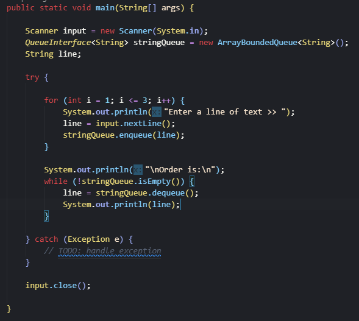

---

## Array-Based Queue Implementation

### The ArrayBoundedQueue Class

- This type of queue is also refered to as a **bounded buffer** because it has a limited size (it is bounded), and can be used to hold information until it is needed (it is a buffer).

- The internal implementation is a typical array

- There are two possible approaches to implementing the enqueuing and dequeuing operations of a queue.

1) We could utliize the **fixed-front design** which mimics a stack. In the queue, **the first inserted element is always the front of the queue and the first slot of the array.**

- We can try doing something similar for a queue, **where the front element of a queue always occupies the first slot in an array** and the rest of the elements follow.

Ex:

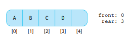

If we want to remove an element, we have to remove from the front of the queue which is always the 0th indexed element.

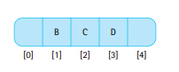

Now if set the first slot to null, we are left with a hole in the array. **To fix this we have to shift every subsequent element down one position!** This operation takes a substanial amount of time, especially for larger queues. 

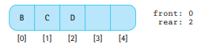
- For a queue of 4 elements, removing an element would require you to shift 3 elements down.
- For a queue of 10000 elements, removing an element would require you to shift 9999 elements down.

**While this approach to dequeuing is simple to understand and implement, it is inefficent (dequeue operation has O(n) time complexity) for larger queues.**

2) We could utilize a **floating-front design** which allows **both the front and the rear of the array to move.**

As expected the enqueue operation will add an element to the end of the queue which will shift the rear index location. But we can then utilize the dequeue operation to shift the index of the front.

- **No need to move elements, just keep track of and shift front and rear indexes.**

However we have a new problem we need to fix!

Suppose if we have an an array where the max capacity is 5 elements and the array is completely filled.
  
front = 0,
rear = 4

then we dequeue an element which will result in these pointers

front = 1,
rear = 4

Now if we add an element, the rear value will shift to 5

front = 1,
rear = 5

**But now if we try inserting an element at this position when the length of the array is 5, we will get an ArrayIndexOutOfBoundsException!** However, this error does not make sense because our array is not truly full!

- Where should this fifth element go to make sure it occupies a valid spot in the array?

- **Because there	may	still be space available at	the	beginning of the array,	the	obvious	solution is	to let the queue elements “wrap	around”	the	end	of the array.**

- In this case the new element should go into the first slot of the array, and then our **rear index should be (re)set** to 0!

front = 1,
rear = 0

Now the array is full!

Lets say I want to dequeue an element, then I would set values[front] to null
and move up the front index.

front = 2,
rear = 0

Then if we want to add a value, then we will increment the rear.

front = 2
rear = 1

Then we will assign the value at values[rear].

**In other words, whenever the rear index hits the back of the list (rear == length - 1), we would reset the rear to 0.** Otherwise we would do the normal and increment the rear.

Pseudocode:

    if(rear == (capacity - 1)):
        rear = 0
    else:
        rear = rear + 1

Or we could use the modulo approach which just sums both statements

    rear = (rear + 1) % capacity

This approach is also called a **wraparound or circular** design.

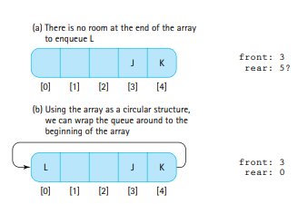

- The circular array (floating-front) solution is not as simple to code as the fixed front design. What do we gain by adding complexity to the code?

- The **fixed front** version of the dequeue operation is **O(n) complexity**.
  
- The **floating front version** of the dequeue operation requires a few steps of incrementing the front or rear index and adding or removing one element. **The amount of work never exceeds a fixed constant regardless of queue size. Therefore the operation is O(1) (constant) time complexity.**

We will use the more effiecent floating front design!

What instance variables are needed for an ArrayBoundedQueue class.
- We need the **elements** themselves in some sort of array
- We need to **define two instance variables *front* and *rear***.
- We need to keep track of the **capacity which will be based on the array's length attribute.** 
- By default the array should have some **default capacity which would be another instance variable.**
- We need another variable to keep **track of the number of elements in the list, this can be an instance variable called numElements.** This variable facilitates the size(), isEmpty(), and isFull() methods.

Look at the ArrayBoundedQueue class to see the implementation.

- Two constructors are used, **one where the array is initialized to a maximum length of CAPCACITY which is the default capacity. Another constructor where the capacity is provided by the user.**
- The Java translator will not generate references to a generic type, our code must specify Object array of class T but instaniate them to be arrays of class Object. This casting is weird and generates warnings but is neccesary. 
- **Note that when the queue holds just one element, front and rear will have	the	same value.**

Lets discuss the operations

- We only enqueue an element successfully if the array is not full. When enqueuing we can use the modulo approach to change the rear index appropriately and then place the new element in the new rear position. Lastly we increment the numElements variable to indicate that we added a variable.

- We can only dequeue and element if the the array is not empty. When dequeuing we first want to get the element in the front to return it later. Then we want to set the element at the front to be null and then shift the front based on the modulo approach once again. Then we decremenet the numElements variable to indicate that we removed a single value. Lastly we return the deleted value which was kept from before.

- The isFull() and isEmpty() methods are based on the number of elements currently in the array which is tracked by the numElements variable.

- The size() method simply returns the value of numElements.

---

### The ArrayUnboundedQueue Class

**How can we create an ever-expanding array if we have to define the size of an array each time we make one, and this capacity by definition cannot be changed?**

- The trick is that we create a new, larger array each time we need it and we copy the elements from the smaller array into the larger array.
- We can reuse some of the design and code from the ArrayBoundedQueue class in 3 different, distinct ways.

1) We could extend from the ArrayBoundedQueue class and overwrite any methods affected by the change (enqueue() and isFull() methods).
2) Instead of using an array to hold the unbounded queue, we could use a bounded queue to hold it and instaniate a new bounded queue and copying over elements when needed.
3) We could reuse the building blocks of the bounded queue design and change the methods a little bit to make the elements[] array expandable and virtually infinite.

We go for option #3!

- **An unbounded queue is never full, so isFull() should always return false.**
- If we hit max capacity we should call another method to enlarge the array (in reality we copy over our elements to a larger array).

Pseudocode:

    if(numElements == elements.length):
        enlarge();

The enlarge method must copy over n elements from the original array to the new array, therefore it will be of O(n) complexity. **We want to avoid calling this method as much as we can. Implying that the enlarge() method should SIGNIFICANTLY increase the capacity. However, if we enlarge it by too much then we waste a lot of time and may end up with a lot of unused space!**

- For our approach we increment the capacity of the array by the original capacity. In other words the enlarge method would do the following:

- newCapacity = currentCapacity + originalCapacity

- With the enlarge method we need to **carefuly step through the elements in our queue beginning from the front and properly wrapping around the end of the array if needed to get to the rear.**

In the worst case, if we add an element when the array is full, we need to copy over n elements before adding the element into a new, expanded array. The time complexity for enqueue() here is O(n).

- However in most situations the enqueue method will not need to call the enlarge methods, therefore the average cost of the enqueue method is constant: O(1). This is call the **amortized time complexity or cost, calculated via amortized analysis.**

**If you are in an environment where consistent efficency is important the average case time complexity might not be the appropriate thing to consider in these environments we would want to eliminate these periodic increases in complexity for the enqueue() method.**

---

## Interactive Test Driver

### The General Approach

Pseudocode for a potential test driver (my test driver is not this complicated and far less interactive)!

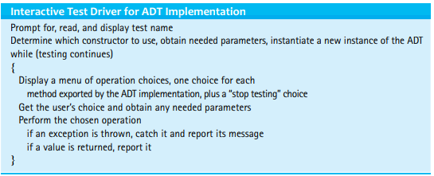

---

### A Test Driver for the ArrayBoundedQueue Class

- Check the ArrayBoundedQueueITD class!

---

## Link-Based Queue Implementations

In a linked based queue we use references to two nodes to keep track of the front and rear of the queue.
- **When the queue is empty, both the front and rear node references should be NULL.** Our implementation of the constructor reflects this.

### The Enqueue Operation

For the enqueue operation we simply insert elements to the rear of our structure.

- First we create a node for the new element.
- Then we add the new node at the rear of the array.
- Then we update the reference of the rear to match our new rear.
- Lastly we increment the variable that keeps track of the number of elements.

To add the queue to the end of the linked list we can simply setLink on the rear node to the new element.
- However, **what if the queue is empty when we add the element, should we add the new element to a null reference?**
- No, **if the queue is empty, this means our rear reference is null. In this case we set our front reference to the newNode instead of linking the rear up to the new element!**
- Then when we update the rear to be the newElement it will work regardless of whether or not the array in its prior state was empty.

Pseudocode:

    LLNode<T> newNode = new LLNode<T>(element); // Step 1
    
    // Step 2
    if(rear == null){ // If the linked list is empty... (this condition could also be (front == null) )
        front = newNode;
    }

    else{
        rear.setLink(newNode);
    }

    rear = newNode; // Step 3
    numElements++;  // Step 4

---

### The Dequeue Operation

With this operation we not only want to remove a node from the front of the linked list, but also want to return its contents!

- For this operation we need to consider what to do if the node we delete was the only node in the linked list.
- Furthermore, if the queue is empty, then we should throw an exception to indicate this and proceed no further.

- First thing we should do is record the value in the current front reference.

- We can "delete" the front node by simply saying front = front.getLink(), because this shifts the front index up one step which deallocates the memory utilized by the original front node automatically.

- If the queue is empty after we delete a node, that would be indicated if the front ended up being null. **If the front is null after completing the dequeue operation (which involves saying front = front.getLink), then we also set the rear to null to reset the state of the queue (recall that if front and rear are both null it indicates an empty queue).**

- Don't froget to decrement the variable which keeps track of the number of elements after all this.
- Also return the contents of the original front reference which you should have recorded as the first step.

Pseudocode:

    if(!isEmpty()){
        
        // Recording the original front's information
        T value;
        value = front.getInfo();    

        // Dequeing the current front by incrementing the front node reference.
        front = front.getLink();
        
        // If the dequeing leaves the array empty, then we reinforce this fact by setting the rear to null as well.
        if(front == null){          
            rear == null;
        }

        // Regardless we decrement the numElements variable and return the value of the original front node.
        numElements--;
        return value;

    } else{
        throw new QueueUnderflowException("Dequeue attempted on an empty queue!")
    }

---

### A Circular Linked Queue Design

- A queue is typically implemented with 2 instance variables that denote either end of the queue.
- However, **we could have one instance variable which referenced the front of the queue we could chain together links to reach the end of the queue.**
- **The downside is that this change would make insertion into the queue a O(n) operation.**

A circularly linked design would also only have one instance variable, and the link of the rear (last) node would point to the front (first) node.
- In this implementation, the only instance variable would be to the rear of the queue.

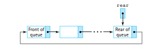

We could enqueue into this queue by accessing the rear node directly!

- The enqueue operation would have a constant, O(1), complexity.
We could dequeue from the queue by accessing rear.getLink() (which is the front of the queue), and saying rear.setLink() = rear.getLink().getLink()

Try this implementation out yourself or look it up online!

---

### Comparing Queue Implementations

The internal array of an array bounded queue takes up the same amount of memory regardless of the implementation.
- **A linked queue only allocates and deallocates space based on whether it is needed, therefore it is more space efficent.** However, each node element in a queue is substanially larger than a value in an array, because the node also contains a reference to the another node.

- For a linked list implementation of a queue, the required space for the references in the queue changes based on the size of the queue.

`Number of required references = 2 + (2* size of queue)`

**Unless the maximum queue size is significantly larger than the average queue size, the difference between the two implementations is negligible.**

- Observer methods are O(1) complexity (ex. isFull, isEmpty and size).
- For the array implementation, n slots of memory have to allocated via the constructor. The queue constructor here has a O(n) complexity.
- For the linked list implementation, only one slot of memory has to be created for the root node. The queue constructor in this case has a O(1) complexity.

- Enqueue and dequeue operations can directly access the rear or front of the queue respectively. The work done by these operations are independent of (unaffected by) the queue size. **Both enqueue and dequeue operations have a O(1) complexity regardless of the queue implementation.**

For an ArrayUnboundedQueue we have to consider the cost of increasing the size of the internal array whenever the queue gets filled up.**For the unbounded queue we could start with a smaller initial array (less time involved to allocate memory), and then only if more capacity is needed will more memory be allocated!**

- However, the cost of resizing the array itself is O(n). **This means the cost of adding an array to the element is usually constant but could sometimes involve resizing, bringing up the cost to allocating n spaces in memory. However, the resizing operation is amortized, which is to say that it is not required very often! Therefore, this O(n) cost of resizing is spread thinly through many enqueue operations.**
---

## Application: Palindromes

A queue or a stack can be used to process palindromes.
- A palindrome is a string that reads the same forwards and backwards (ignoring spacing and punctuation).

Some examples of palindromes:
-"Eve"
-"Won ton? Not now!"

### The Palindrome Class

First we need a method that checks to makes sure the initial given string is a palindrome. This can be implemented as a static method, therefore we don't need a constructor for the class.

- We will call this method "test"

This method will create a stack and a queue! 
- **The first character popped from the stack will be the last letter (since a stack is a LIFO structure).** 
- **The first character dequeued from the queue will be the first letter (since a queue is a FIFO structure).**

**We can compare these two characters in a loop until either the stack or queue is empty and if at any point they don't match we have determined that the string as a whole cannot be a palindrome.**

- We can choose to use any implementations of the stack and queue, but since we know the size of the string prior to making the stack and queues it's best to use bounded implementations for space efficency (it should not matter for the purposes of just testing tho).

---

### The Applications

There are probably (definitely) better ways to solving the palindrome problem, but this approach utilizes both of the data structures we have learned so far.
- This application is interesting, easy to code, and intuitive!
- **We can always use any combination of ADTs and structures to solve a problem, we are not limited to a single object or type!**

---

## Queue Variations

Additional operations could be included in the queue definition to create a more versatile data structure.
- Maybe an operation could allow the user to peek into the front, rear, or certain position of a queue.
- Or we could expand the access rules to create a structure that could be a generalized version of both a queue and a stack (i.e. a double sided queue).

Important to note!
- A PriorityQueue ADT is often considered alongside traditional queues.
- **In this queue, when we call dequeue, the highest PRIORITY element is dequeued as opposed to the element strictly in the front of the queue.**
- **BIG DIFFERENCE: The order in which elements enter the queue does not decide when the elements will exit the queue.**

### Exceptional Situations

Rather than throwing exceptions, **we could tweak the queue implementations to deal with special cases (i.e. removing an element from an empty queue, or adding an element to a bounded and filled up queue) by simply nullifying invalid operations.**

- The invalid operations could return null or false if the operations are unsucessful.

In the case of enqueue, the most common case for failure is adding an element to a filled, bounded queue.
- **But you could also add more restrictions to prevent duplicate elements, or has specific constraints on the elements themselves.**
- Rather than redefining the operations we could also write new methods that enqueue and dequeue with specific constraints in mind. (i.e. safeEnqueue, safeDequeue).

---

### The GlassQueue

The idea of the GlassQueue is to be able to **peek at the front and rear elements of the queue.** This queue supports all the operations of a traditional queue but adds the functionality to peek at either end via the **peekFront and peekRear methods**.

- You may think we need to create a whole new interface to accomplish this, but in fact we can inherit the QueueInterface class to create a more terse definition for a new GlassQueueInterface class. 

- Check the files for the GlassQueueInterface and LinkedGlassQueue classes.

---

### The Double-Ended Queue

**A double-ended queue is a data structure that allows the user to enqueue and dequeue elements from both sides (front and rear) of the queue.**

- We typically shorten **"Double-ended queue" to Deque, which is pronounced as "deck".**

- The operations from a deque are not just additions to a traditional queue but are completely different.

- **Now we could choose have to distinguish between enqueueFront and enqueueRear and similarly with the dequeue operation!**

- **Or the DequeInterface could extend the normal QueueInterface and simply add the enqueueFront and dequeueRear methods**

- I chose the second approach as its less work :)

- Implementations of the array-based and link-based deques are exercises in the book! But you can find the DequeInterface in these files.

---

### Doubly Linked Lists

If we try to create a deque with a linked list it is extremely annoying to understand how to implement the dequeueRear operation.

- **A solution could be to base the Linked List implementation of the Queue on a whole different type of node!**

A Doubly Linked List is a list which is created with **nodes that have two pointers / references: one to the next node, another to the previous node.**

- **The textbook uses the terms forward and back but I prefer previous and next.**

A DLLNode will have methods to set and get both the next and previous node references.

We can then create a deque with the doubly-linked nodes which will look like this conceptually:

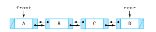

In order to dispose of Node D we need to dereference it, in other words remove all references to Node D!

The first step would be shifting up the rear element such that the new rear is the previous node from the old rear.

In other words:
`rear.getPrev();`

Now rear points to Node C. But we also need to remove the link between Node C and D!

**In other words we can modify the previous step to also set the next node of Node C to null**:

`rear.getPrev().setNext(null)`

Now the link between the nodes C and D are completely severed. **All that is left it to reassign the rear to its own previous node, which will then completely dereference Node D.**

In other words:
`rear = rear.getPrev();`

**If rear.getPrev() is null prior to starting this algorithm then we know that we are dealing with an empty deque and we should reassert that fact by ensuring both the front and rear references are null.**

This dequeueRear operation has a constant time complexity! No loops are involved. 

- The same operation with standard LLNode nodes would require n steps because we would need to start from the front of the queue to get to the second last node (we would need to traverse n-1 nodes in a loop!).

- However, note that DLLNode object takes up quite a bit more space than a traditional node with a single reference. But with modern machines that have inexpensive and ample storage, this extra space requirement is typically negligible!

---

### Java's Collection Framework Queue/Deque

Java's implementation of a queue has two major differences compared to our queues.

- **Elements are not required to be added to the rear of the queue. They can be ordered based on their priority value (i.e. Priority Queue ADT in Chapter 9).**
- Two operations can be used to enqueue an element: **add() or offer()**. The add() method throws an excetion if invoked on a full queue. The offer() method returns a false value if you attempt to enqueue on a full queue (otherwise it returns true).

Java has 4 classes that implement its own Deque interface: ArrayDeque, ConcurrentLinkedDeque, LinkedBlockingDeque, and LinkedList. (that's correct, the built in LinkedList uses double linked nodes!)

- **By restricting method use the Deque interface could be used to implement a stack (only allow dequeueing and enqueuing from one end), or as a queue (allowing dequeueing and enqueueing from opposite ends).**

---

## Application: Average Waiting Time

Queues are used whenever a "customer" entity is waiting to be "serviced".
- For a CPU: Processes waiting to be processed.
- For a Printer: Print jobs waiting to be printed.
- For a restuarant: People waiting to order food.

We want quick response times, print times, and order time, and this can be accomplished by minimizing queue waiting time.

**One solution is to add more queues:**
- If we have more cores, then processes take less time because they can sort themselves into different queues corresponding with each core.
- If we have more printers we can print more paper simultaneously.
- If we have multiple counters we can serve more people at once and over a given time frame.

However there is always some cost involved in adding more queues!

**In the real world we analyze queue waiting times to understand when and if to employ additional queues based on a target time. In other words we need to make a tradeoff depending on the average waiting time to attain our goal or to adjust it based on external constraints (cost involved with employing more queues).**

---

### Discussion and Examples

Well we can dissect the time spent in the queue into two segments!
- Ask yourself?: When you get to the front of the queue, do you get served instantaneously? No, there is a service time involved. This may be the amount of time it takes for a process to execute, or the amount of time required to give your order.

Therefore the total or **turnaround time** for each element can be broken down into two parts:

`turnaround_time = waiting_time +  service_time`
`waiting_time = turnaround_time - service_time`

- The waiting time can be calculated by getting an arrival time, finish time, and service time.
- The arrival time is the discrete time the task arrives in the queue.
- The finish time is the disrete time the task finishes its slot in the queue. In other words:

`finish_time = arrival_time + service_time + waiting_time`
`service_time = finish_time - arrival_time`

How can we get to solving the waiting time based on the arrival time, finish time, and service time?

`waiting_time = finish_time - service_time - arrival_time`

Ex. 
Assume a simulation where customers order and place their orders into multiple queues.

This could be a tabular representation of when each customer arrives and how long it takes to service the customer:
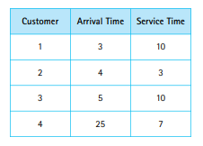

And here is the time based scale representation!
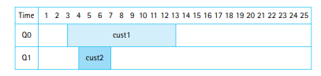

- Note that Customer 2 arrives before Customer 1 finishes, therefore that process is put into a separate queue.
- However Customer 3 also arrives before either Customer 1 or 2 are finished, so we could add another queue.
- But what if we only have two queues?
- In this case, even though the arrival time is 5, Customer 3 can be placed right after Customer 1 finishes in the lower numbered queue.

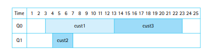

Now we can observe that although Customer 3 arrive at t=5, their process begins at t=13. Therefore their waiting time is 23-10-5 = 8 seconds.

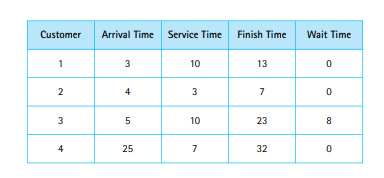

We can create a Customer class to model these times (arrival time, service time, and finish time).

---

### The Customer Class

Each Customer object will eventually need to know its arrival, service, and finish times.

- Objects will need to be enqueued and dequeued from queue objects to simulate entering and exiting real world queues.

Class implementation is straightforward.

---

### The Simulation

For the simulation we create customers the have arrival times in a particular range. The starting times of the Customers in the line must also fall within an appropriate range.

- We could read these values from a file or we could randomly generate them.
- The textbook chose to randomly generate them!

The service times can be chosen completely randonly as long as the user has given a min and max start time.

The service time is an amount of time, but the arrival time is a discrete unit of time i.e. the number at which the service time begins.

---

## Concurrency, Interference, and Synchronization

### The Counter Class

---

### Java Threads

---

### Interference

---

### Synchronization

---

### A Synchronized Queue

---

### Concurrency and the Java Collection Classes
