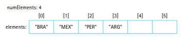
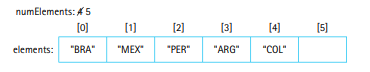
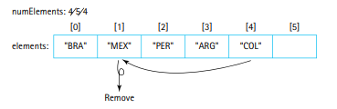
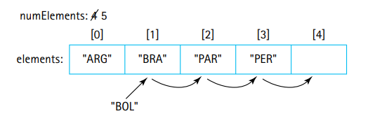
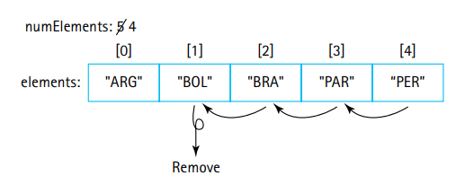

# The Collection ADT

The Collection ADT provides the ability to store and retrieve information.

- Typical collection ADTs such as the Stack and the Queue allow restricted access and retrieval of data by allowing us to put and take out data from one of two ends of the structure.

- **The Collection ADT eases up on these restrictions!**

- **If we can store our objects in a sorted fashion, then this opens up possibilities of using algorithms such as the binary search which significantly decrease the time it takes to retrieve objects.**

- **In order to store data in a structured and sorted manner, we also need to ask our self how to compare two objects.** What does it mean for two objects to be equal, or for one to be greater or less than another object?

## The Collection Interface

Stacks and queues are useful in particular situations.
- **Stacks are most useful for accessing most recent data first!**
- **Queues are most useful for processing data on a first come, first serve basis!**

Restrictions on how we can insert and remove data into and from these structures ensures that we use them for properly.

But how about situations where you need to look up data? In other words, **what if you need to search for data based on some other information such as an ID?**

Ex. **Obtaining a bank account number based on some SSN number.**

**The external information that you search based on is often called a "key" across most computer science disciplines.**

- We need a data structure that stores information and allows us to retrieve it all based on some "key" (ex. ID) part of this information.

- The order in which we inserted an object has no effect on when we can retrieve it, we can always retrieve any object in the collection based on its contents and more specifically its key.

- **The equals() method from the Object class considers two objects to be equal if they are aliases of each other.**

Ex.

    Car a = new Car("Ferrari", "488 Italia", 450000);
    Car b = new Car("Ferrari", "488 Italia", 450000);

    // Are cars a and b equal to one another? In other words are they the same car?

    // If you are using the .equals() method from the Object class, NO!

    boolean isEquals = a.equals(b) // isEquals is false!

    // a and b are two distinct objects, so the Java compiler knows they are
    // not the same object, therefore they are not equal.

Ex.

    Car a = new Car("Lamborghini", "Huracan", 300000);
    Car b = a;

    // Are cars a and b equal to one another? In other words are they the same car?

    // If you use the .equals() method from the Object class, YES!

    boolean isEquals = a.equals(b) // isEquals is true!

    // Car a is a new car, but Car b is not a new car, it just points to Car a. In other words, both reference variables point to the same underlying object, i.e. they share the same memory location. Because of this, you can say that they do in fact refer to the same car object in memory!

- Hopefully with the examples you can see that the Object class only considers two objects to be equal if they are aliases of the same object, or aliases of each other.

- Usually **we want equality to be defined by the contents of the two objects, rather than being based on whether the two objects are aliases of the same memory location.**

In other words we want this:

Ex. 

    Car a = new Car("Ferrari", "488 Italia", 450000);
    Car b = new Car("Ferrari", "488 Italia", 450000);

    // Are cars a and b equal to one another? In other words are they the same type of car with the same attributes?

    // We want the answer to be YES

    boolean isEquals = a.equals(b) // isEquals should be TRUE!

**- We can accomplish this by overriding the equals method of the Object class with our own definition of equals() in the Car class!**

- **For now we will be using the String class for the collection. The built-in String class already has a equals() method that overrides the Object class's method. The String class's override method compares the contents of two strings!**

### Assumptions for Our Collections

We will implement a basic collection that allows for the addition, retrieval, and removal of elements.

- **Our collections will allow duplicate elements.**
- **Two elements are considered to be duplicates if**
`element1.equals(element2)` **returns true (remember that the .equals() method should be overriden and not the same one from the Object class!)**

- When we try to find an element that has a duplicate, any of the copies of the element may be returned (typically the first duplicate we find is returned).

- **Null elements cannot be used as arguments, this will not be enforced via a try-catch but will be a precondition for anyone trying to use the collection's methods. This removes the need to test for null pointers every time we try to use a method's arguments.**

- Other than that there are very minimal preconditions...

- We DO NOT require the remove operation to remove an item that is in the collection. Rather, if the element we are trying to remove is not found, we just return false to indicate that the operation failed!

**We follow an identical approach with all operations. If the operation is successful we return true, otherwise we return false.**

Ex. Trying to `add()` into a full collection will return false!

---

### The Interface

**Just like stacks and queues, our collections will be generic and therefore the interface will be generic as well.**

Take a look at the CollectionInterface.java class and read the comments to get a better understanding of each method and the functionality of a collection!

---

## Array-Based Collection Implementation

If a collection has N elements, we hold the element in the first N locations of the array.

- We maintain a constant **numElements to keep track of the number of elements in the array.**

Ex.

**When we add an element to the collection, we simply increment numElements and place the new element in the next empty slot.**

Ex.

What is a bit more difficult to understand is what happens when we remove an element.
- When we remove an element, we do not want to leave any gaps or holes in the array.**In other words if we remove the second element we do not want there to be "hole" in the array where there are still elements before and after the index where the element used to be.**

- To remedy this, **we could shift down the positions of all the elements after the index of the removed element.**  But this would be very expensive in terms of time. (worst case: n-1 shifts where n is the size of the array).

- **However, since order does not matter, we can simply take the last element in the array and use it to fill the hole in the array.**

Ex.

Check out the ArrayCollection class that implements the CollectionInterface to see how this is implemented. The next notes refer to this class.

The implementation should be pretty straightforward if you have already seen and implemented the array-based implementations the Stack and Queue ADTs.

- Similar to what occured with the Stack and Queue array-based implementations. We have to make an awkward cast to cast an array of objects into type T which generates a compiler warning.
- We cannot avoid this.

Two constructors can be used, one which creates a collection with a default capacity of 100, and another which creates a collection with a specified capacity.

- The **find() method is a protected helper method which is used by other methods that need to search the array for elements**

- **Since most other methods (contains(), remove(), and get()) need to search the array to some extent, they will all use the find method!**

- - **The existence of the find() method removes the need to create similar code over and over again in the removes, contains, and get methods!**

- The find() method changes the values of instance variables *found* and *location* to indicate if the element was found and where it was found.

---

## Application: Vocabulary Density

The vocabulary density of a text is:

`total # of words / total # of unique words`

We will develop an application that reads a text file and calculates it vocabulary density by reading the number of words it has and the number of unique words it has.

- **A word will be defined as a sequence of characters (A-z, a-z) that are potentially followed up by an apostrophe somewhere in between.**

Ex: "The", "Molly's", "Qu'hito", "parley"

- We also ignore case when determining if a word is unique.

- **In other words "The", "the", and "tHe" will be counted as the same word for the purposes of counting up the number of unique words.**

To count the number of unique words we can use a collection to keep track of the number of words encountered thus far.

- **In essence the algorithm will read through the text word by word, checking if each normalized (lowercased) word is already in the collection. If the word is not in the collection, we add an all normalized (lowercased) version of the word to the collection. If the word is in the collection we skip adding it to the collection. Throughout the algorithm we keep track od the number of words we read. And by the end, the size of the collection is the number of unique words. We can then simply say:**

Check the VocabularyDenisty class to see the algoithm in action on a given file name.

`density = # of words read / size of collection`

Some notes regarding the actual application:

- The code is super simple because so much of the complexity is handled by the Collection class. Hooray for abstraction!

- This program **utilizes a try-catch to deal mainly with an IO exception that may be thrown by the FileReader if an invalid file is passed (the file could not be found). Another way to deal with might be to just say that the main method throws the IOException, instead of using a try-catch (this is how the book does things).**

- We use the Scanner class to break down the input file into words. This is possible because we define a specific set of delimiters that are what split up the words in the file. **To understand why the delimiters were specified the way they were, read the comments in the file.**

- **The toLowercase() method normalizes the words before we check them against and/or add them to the array. Recall that we DO NOT want to count "Hello" and "hello" as distinct words and end up adding both.**

- The constant capacity is used to hard-cap the number of words our collection can hold. If the file contains more than this capacity we could further add a statement that says it contains at least x words, and then we could not predict the density! Check exercise 5.12a to in the book to further apply this.

---

## Comparing Objects Revisited

In order to understand how objects are identified and compared, we need to understand how to determine the equality of two objects.

- **Understanding what it means to compare objects and determine which object is "greater" or "lesser" will allow us to try to store objects in a collection in "increasing" order.**

- **If the elements in a collection are sorted, we can use algorithms such as the binary search to drastically decrease the time we would need to find an element!**

- **But what does	it mean	to store elements “in order”? To	 understand	this we	need to understand object comparison by examining the equals() method and the compareTo() method (from the Comparable interface)!**

--- 

### The equals() method

When comparing objects with the comparison operator (==) the comparison is actually made between the two reference variables that point to the object and NOT between the contents of the two objects.

- The equals() method that comes from the Object class behaves exactly like the comparison operator.

Ex.

    Circle c1 = new Circle();

    Circle c2 = new Circle();

    boolean a = c1.equals(c2) 
    // Will be false if the Circle class inherits the Object class's equals() method

    boolean b = (c1 == c2)
    // Will always be false.

When we write the equals() method of the Circle object, we can write the method we want!

Ex.

    @Override
    public boolean equals(Object obj){

        if(obj == this){
            // If the two objects are pointing to
            // the same thing in memory, then of cours
            // their contents are the same.
            return true;
        }

        else if(obj == null || obj.getClass() != this.getClass()){
            // If a null reference is passed or
            // the class of the passed obj is not the
            // same as the class of the Circle() object
            // then we don't even need to compare the
            // contents! We know the two objects cannot be equal.
            return false;
        }

        else{
            // We know that both objects (the circle and the passed object)
            // must be of the Circle class, we just need to cast the passed
            // object first.

            // Then if the two objects have the same radius we know their
            // contents are the same so we return true, otherwise we return
            // false.

            Circle c = (Circle) obj
            return (c.radius == this.radius);

        }

    }

In regards to the implementation of the previous equals() method note a few things that are considered good practice.

- @Override notation indiactes to the compiler that we intend to override an ancestor's method. The compiler now double-checks the syntax to re-affirm that the method is actually overriding another method.

- The if clause at the top checks if we are comparing a circle to another alias of itself. If so we just return true, no need to check contents.

- The second if clause (else-if) checks if the argument is null, if it is we return false. **If the argument is null, everything to the right of the || sign is not even evaluated, since as long as one operant is false the whole thing is false**.

- If the obj passed is not a null reference then we further ensure that the two objects being compared (this and the obj) are of the same class. If they are not objects of the same class then they cannot possibly be equal to another (by our definition).

- If the processing comes to the else clause, then we cast the obj argument safely (since we know obj must of type Circle) and then compare the contents (the radii) to determine if the two objects have identical contents.

`c1.equals(c2)` now has a whole new meaning based on the overrided method.

**The key of a class is the set of attributes to determine the identity of a class. For a circle this is the radius!**

Ex. 
**Suppose I tell you to write an equals method for the FamousPerson class. If I say the unique set of attributes that distinguish two famous people is [firstName, lastName], then how would you code up the equals() method?**

Answer:

    public boolean equals(Object obj){

        if(this == obj){
            return true;
        }

        else if(obj == null || obj.getClass() != this.getClass()){
            return false;
        }

        else{
            FamousPerson fp = (FamousPerson) obj;
            return (this.firstName.equals(fp.firstName) 
                    && this.lastName.equals(fp.lastName));
        }

    }

Take a look atthe FamousPerson class and the FamousCS.txt file. We will use these two files to create an application that will store the information from the text file into a collection.

- Debug the program to see how it works. I hope we know how to do that by this point.

- The key takeaway is this. As long as the user provides enough information to locate the item in the collection, **in other words as long as the user provides the keys** (based on the object's overriden .equals() implementation), we can pass a partial object to find what we want.

- **In this case we only needed the first and last names and then constructed the partial object from those keys**

`person = new FamousPerson(fname, lname, 0, "");`

- This object is not complete but we can use to to find an "identical" element since an element is considered equal to this one if they share the same firstName and lastName properties!

        if (people.contains(person)) {
            person = people.get(person);
            System.out.println(person + "\n");
        }

Breakdown:

`person = people.get(person);`
- If we find the person object inside the people collection, then we get the actual object that matched and reassign person to point to this retrieved object (retrieved via .get() method).

`System.out.println(person + "\n");`
- This might be confusing if you don't know the intricacies of Java. But basically, printing an object actually calls the toString() method of the object. We have overrided the Object's toString() method in the FamousPerson class, therefore our custom implementation of toString() is called in this line.

---

### The Comparable Interface

The equals method allows us to check whether a particular element is in a collection.

- **The compareTo() method extends the functionality to not only see if two objects are equal but also if one object is less than or more than another.**

- **compareTo() returns a negative integer, zero, or a positive integer as this object is less than, equal to, or greater than the specified object respectively.**

Ex.

    int result = obj1.compareTo(obj2);
    // If obj1 > obj2 returns 1
    // Else if obj1 = obj2 returns 0
    // Else (if obj1 < obj2) returns -1

**If we use the compareTo method of a class to sort the objects of a class, this order is considered the natural order.**

- The compareTo() method's implementation should reflect the real world order of particular strings. In other words, strings should be arranged alphabettically, numbers might be stored in increasing order, golf scores might be sorted from high to low (since low means better in golf), and e.t.c

- **For a Car() object you might want to sort the cars based on increasing mileage, or maybe increasing price. Or some combination of the two, you can define this order via the compareTo() method.**

- We can use the Comparable interface with generics
`public class ClassA<T> implements Comparable<T>`

Using generic types with the compareTo() method ensures that we only compare compatible objects!

- Lets create a compareTo method for the FamousPerson class:

    public int compareTo(FamousPerson other){
        if(!this.lastName.equals(other.lastName)){
            return this.lastName.compareTo(other.lastName);
        }
        else{
            return this.firstName.compareTo(other.firstName);
        }
    }

Lets break down the approach above.

- First we check if the lastName property between the two objects is identical.

- **If the lastName is not equal between them, then we compare the lastName and return an int (which has to be -1 or 1) based on which lastName is greater as a String (which one alphabetically comes first).**
  
- **Else, we know that the lastName property IS EQUAL between the two objects. Then we have to resort comparing the firstName property and return a result based on which object has a firstName that comes first alphabetically. (could return -1, 0, or 1)**

- Note that if the two objects have the same lastName and the same firstName then this else statement is entered and evaluates to 0 (sinc firstName property is equal).

Ex. 
FamousPerson objects with the respective first and last names:

obj1 : Kalpesh Chacha
obj2 : Kalpesh Chavan

obj1.compareTo(obj2);

**Goes inside if statement since the two lastName strings are not equal, then we return based on the fact that obj1's last name (Chacha) comes first alphabetically (compared to Chavan). Therefore we return 1.**

obj1: Kelp Chavan
obj2: Kalpesh Chavan

obj1.compareTo(obj2);

**Goes inside else statement since the two lastName strings are equals, then we return based on the fact that obj2's first name (Kalpesh) comes first alphabetically compared to obj1's first name (Kelp). Therefore we return -1**

obj1: Kalpesh Cha
obj2: Kalpesh Cha

obj1.compareTo(obj2);

**Goes inside else statement since the two lastName strings are equal and then compares the two firstName strings and we realize that the firstName's are also lexographically identical. Therefore we return 0 based on the result of comparing the firstName strings (in the else statement).**

---

## Sorted Array-Based Collection Implementation

The initial ArrayCollection.java class assumed that all elements were just meant to be dumped into the next available slot in the array.

- **We did not care about the order of the elements in the arry (based on how they compare with one another) for the basic ArrayCollection.**

- The add() operation for the ArrayCollection has a constant, O(1), time complexity. But all other operations: get(), contains(), and remove(), operated in O(n) time complexity.

- **If we keep the internal array sorted as we keep adding and removing elements, then the searching mechanism behind the contains() method can be a binary search algorithm! This would also benefit the get() and remove() methods that use the contains() methods for the bulk of their work!**

- **This would drastically simplify the complexity of our contains(), get(), and remove() methods to O(log(n)).**

- The tradeoff would be the complexity of the add() method, since the method now needs to add an element in the right place of the array which is a complicated O(n) process.

- Our new implementation **will also be unbounded to hold a larger amount of elements and to truly utilize the better and more efficent algorithms behind the primary operations.**

- **The enlarge() method will be implemented and invoked internally by the add() method whenever needed!**

---

### Comparable Elements

Can you force applications to use Comparable classes when providing an argument for a generic type? YES

- **A bounded type has a type parameter (like T) but we restrict what T can possibly be based on saying that T should implement or should extend some other interface or class. **

Ex. `ArrayBoundedStack<T implements Comparable<T>>>`

So the T specified as the concrete type for the stack during creation MUST implement the Comparable type.

Following this example we can create a dummy class called Duo.java (check it out in the files or see it below).

    public class Duo<T extends Comparable<T>>{
        
        protected T first;
        protected T second;

        public Duo(T first, T second){
            
            this.first = first;
            this.second = second;

        }

        public T larger(){
            if (first.compareTo(second) > 0){
                return first;
            } else{
                return second;
            }
        }

    }

Note that for the Duo class, the parameter T, specified in the class header, must implement the Comparable<T> interface.

- Wait so why do we say "extends" in the bounds instead of implements???
- Confusing java syntax. Just remember to always say extends within the bounds of bounded type.

`Duo<T implements Comparable<T>>` WILL NOT WORK!

- For generics we just use `implements` for everything!

- If we tried to instantiate a Duo object with a type for T that did not implement the Comparable<T> interface, then the compiler would throw us errors! (our program would not run!)

- According to the textbook:
  "Attempting to declare an array of <T extends Comparable<T>>	results	in a syntax	error. So we need to find a	different	approach. Rather than try to enforce the use of	Comparable classes using syntactic means we	will use our “programming by contract”	approach. **We specify as	a precondition of the add method that its	argument is comparable to the previous objects added to the collection.** **As the add method is the only way for an element to	get	into the collection, we	are	guaranteed that	all	elements held in	our	SortedArrayCollection can be compared to each other.**"

  The long and short of it is that:
  `SortedArrayCollection<T> implements CollectionInterface<T>`
 is how the dumb book makes the header look, **this means that we are forced to try and cast any variable of type T whenever we use it to call compareTo() to reinforce that it implements Comparable so that the compiler can assume that it has an implementation of the method.**

 More experienced developers know that to avoid always having to cast, we can enforce that the type T that we use to create the Object should implement Comparable to begin with via the Constructor and the class header!

 To do that we modify the header a bit!
 `SortedArrayCollection<T extends Comparable<T>> implements CollectionInterface<T>`

---

### The Implementation

The internal representation of teh SortedArrayCollection class is an unbounded array that enlarges itself whenever it hits its maximum capacity.

- The array must always be kept sorted. Anytime we add any elements, they must be added to ensure that the order stays unchanged (be it least -> greatest or greatest -> least based on the compareTo() method)!

- **The enlarage() method increases the size of the internal array by the original capacity (the capacity the array initially started with before any enlargement).**

- **The find() method of this class serves the same purpose as the find() method of the unsorted ArrayCollection class. However, the sorted nature of the elements allows us to use a faster, binary search, algorithm to find the element. This find method has a worst case time complexity of O(log(n)) as opposed to O(n), which was the worst case complexity finding the element in an unsorted collection.**

- The original implementation of this class (which you can find online) requires the passed element to be casted into a type of Comparable to utilize the compareTo() method in the find() method. **My implementation does not need this casting because the list can only be declared with a type T that MUST implement Comparable<T>.**

- When we go to add in an element we cannot simply add an element to the end of the list. We must first call find() on the element. Why?

`find(element)`

**The find method has a bonus functionality. If the element is not found, then the found variable is false, but the location variable is set to the index where the element should be inserted.**

- **We make use of the changed location variable to know where to insert the new element! First we shift all the elements at and after the location by 1 position up (to the right if you visualize it as an array). This creates a gap at the index specified by the location variable. Then we can safely insert the new element at the location (because it will not be overwritting any pre-existing value).**

Visual:

- **The remove method similarly just shifts all the elements after the location down by one. So starting from index: location, we say : elements[i] = elements[i + 1]; This wipes out the value at the location (overwrites it) with the next value and so on and so forth. We simply say that we shifted all the elements after the location down by 1.**

Visual:

### Implementing ADTs "by Copy" vs "by Reference"

If we wanted to handle elements

---

## Link-Based Collection Implementation

---

## Collection Variations

---