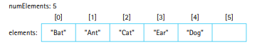
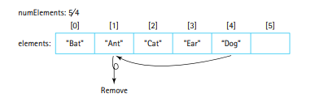
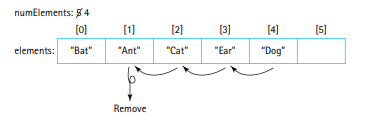
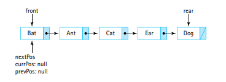
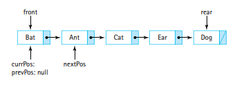
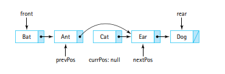

# The List ADT

Lists are one of the most widely used ADTs in computer science becuase similar to queues, they translate directly into many real-life use case scenarios.

- **They are similar to stacks and queues in the sense that there is some sort of order imposed on the internal elements.**
- **However, unlike stacks and queues, there are no restrictions on adding, accessing, and removing elements from any location.**

## The List Interface

A list a linear collection of elements which share some linear relationship. 

- Each element in the list has a unique predeccesor and a unique succesor (with the exception of the first and last elements respectively).

- Each element has a position or index.

**In addition to supporting the familiar get(), contains(), add(), remove(), isFull(), and isEmpty() methods, a List will support more index related operations**.

- **An list cannot sustain any "holes", in other words, if we remove an element from the middle of the List, we must shift down the preceding elements to fill in the gap. The elements must be contiguous.**

- Valid indexes go from 0 to list.size()-1

- **If an element is removed from the list, then the other elements that come after the removed element will have their indexes lowered!**

---

### Iteration

**We need to provide a mechanism to process the entire list, element by element, from the first element to the last element.**

- Note that **Java has 2 interfaces to help us accomplish this task: Iterable and Iterator.**

**The List class will implement the Iterable interface, which requires us to create a method, iterator(), that creates and returns an Iterator object.**

Sidenote: Methods that create and return objects are called Factory methods.

An object of class **Iterator has** the means to iterate through a list.  It has 3 operations: **hasNext(), next(), and remove().**

- **An Iterator object initial value starts at the beginning of the list.**

- Everytime we call .next() we get and return the next element move the iterator to the next element.

The iterator object's **next() method will return objects from the list one by one in a sequential order until it hits the end of the list.**

- We can **use hasNext() to check if there is a next element to move to, and based on this we can use this method to know when we hit the end of the List.**

Since our implementation of the list implements the Iterable interface, the front side method can call iterator() and get an Iterator object which can be used to iterate through the list.

Ex:

        List<String> strings = new List<String>();
        strings.add("alpha");
        strings.add("gamma");
        strings.add("beta");
        strings.add("delta");

        Iterator<String> iter = strings.iterator();

        while (iter.hasNext()){
            hold = iter.next();
            if (hold.equals("gamma")){
                iter.remove();
            } else{
                System.out.println(hold);
            }
        }

Note that you can have several iterations through a list active simultaneously using different iterators!

- What would happen if you modify the underlying list in between the iteration process? Like if you insert or remove an element in the middle of iterating? Just don't. It causes headaches.

- Results are unpredictable if the underlying collection is modified (by some means other than the remove() method)while the iteration is in progress.

- The enhanced for loop will work with any Iterable object! The enhanced for loop is also sometimes called a for-each loop.

Ex.

        for(String hold: strings)
            System.out.println(hold);

- **In essence, the for-each loop is an abstraction of the underlying iterator object that an Iterable collection can make. The hasNext(), and next() methods are invisible and taken care of by the compiler!**

---

### Assumptions for our Lists

The list object will support both index and iteration-related operations.

- The lists will be unbounded. Even through the underlying structure is an array, **whenever the user attempts to add an element to a full array, we will first call an enlarge() method to copy over the original array of elements to a new, larger array!**

- We will allow duplicate elements. Whenever an operation involves finding an element, it may find any of these duplicates. There is no distinction between the duplicate objects with the exception of the indexOf method.

- We do not support null elements and null elements cannot be used as method arguments.

- The possible values for the indexes reflect that the internal array is contigious and has no holes.

- The add() and set() operations are optional. For a sorted list the set operation could override the requirement that the list needs to be sorted at all times. Therefore we will allow a sorted list to throw an exception whenever these optional methods are invoked.

---

### The Interface

Look at the java file: ListInterface.java

---

## List Implementations

We can develop an array-based or linked list based implementation of the List ADT. **A list itself is a collection, so there are plenty of similarities between implementations of the Collection ADT and the List ADT.**

- The emphasis here is on the new functionality: indexing and iteration. The rest is practically identical to how it was implemented in the Collection ADT.

---

### Array-Based Implementation

Elements are stored in an internal array.

- **The instance variable numElements stores the current number of elements in the List.**

Ex:
 A List with 5 elements

- **We can only add an element into the array if numElements < elements.length()**
- **To add an element into the list we utilize numElements as the index to add the element into!**
- **Then we also increment the value of numElements to indicate an additional value has been added and to ensure that the next element is added into the correct slot**

In code this would mean:

        if(numElements < elements.length){ 
            // Note that for this condition we could make use of an isFull() method instead!
            elements[numElements] = value;
            numElements++;
            return true;
        } else{
            return false;
        }
        

- Lets say that we used the same approach for the remove() method from the ArrayCollection class in the ABList class.

In code this would mean:

    find(target);

    if(found){
        numElements--;
        elements[location] = elements[numElements]
        elements[numElements] = null;
    }

    return found;
    // found will be true or false based on whether
    // the element was found.
    // if it was found, then removal was successful
    // and we return true.
    // if it was not found, then we never removed
    // anything and we return false.

If we tried doing this on our previous example to remove the entry "Ant":

**FOR A LIST WE NEED TO MAINTAIN THE INDEX ORDER OF THE REMAINING ELEMENTS**

- In other words, we cannot rearrange the relative positions of the elements, their order must be maintained.

**So instead of taking the approach of the ArrayCollection class for removal, we take the approach of the SortedArrayCollection, which is to shift down the indexes of the elements that come after the removed element.**

In code this would mean:

        find(target);

        if (found) {
            for (int i = location; i < numElements - 2; i++) {
                elements[i] = elements[i + 1];
            }

            numElements--;
            elements[numElements] = null;
            

        }

        return found;

Ex. This would be how we remove the entry "Ant" from the List.

Now lets get into the interesting stuff: Index-Related Operations!

- There are 5 indexed methods, 4 of which follow the same pattern. 

- **Before doing any operation, they check the int index argument and if the index is outside the valid range they explicitly throw the IndexOutOfBoundsException with a custom message.**

- Logically there isn't a big difference between an array and a List. In face some languages such as Python use the term interchangeably! Therefore, the index based operations should be straightforward to understand!

- Just like array indexes, list indexes will start at 0 (because internally a List is just an array). But the list indexes will be limited by the current size of the list, which may not be the actual endpoint of the internal array.

Here is the set() method for example:

        public T set(int index, T newElement){

            if( (index < 0) || (index >= size())){
            // If the index is less than 0,
            // or if the index is greater than
            // or equal to size (which is the numElements)
            // of the internal array, then we
            // notify the client that the index
            // is deemed as invalid.
                throw new IndexOutOfBoundsException("Illegal index of "+ index +" passed to ABList's set method!");
            }

            T temp = elements[index];
            // We store the element currently at the index
            // before it gets overwritten. We do
            // this so we can return this
            // replaced element later.

            elements[index] = newElement;
            // The value at the given index
            // is replaced with the given element
            // hopefully this is super easy to understand!

            return temp; 
            // We return the replaced element.
            // The client may want to use it for some
            // purpose (to know what element was replaced)

        }

- Other indexed methods are very similar but the add() and remove() methods require shifting array elements.

- We already discussed add() and remove() methods where the user can specify an element to find and remove. **The indexed versions of these methods accept an index argument only, and just add a value at the index or remove the element at that index (given it is valid).**

An aside if you are lost as to how you would implement a few of these indexed methods:

- **If we wanted to add a value at a particular index, every element currently at the given index and at proceeding indexes would have to shift up their positions by 1 to create room for the new element to fit in!**

- **If we wanted to remove a value at a particular index, we would simply shift down every value after the given index by 1. This would overwrite the value at the given index and decrement the indexes of each proceeding value by 1.**

Now to another category of methods that we will need. These methods will allow our lists to support iteration.

- These methods that support iteration are NECCESSARY since the ListInterface extends the Iterable interface.

- **Based on the contract of the Iterable interface we need one method with the signature:** `Iterator<T> iterator();`

Now we need to make and return an Object that is or extends the Iterator class (with the generic in mind).

We can use one of three approaches:

- **We can use an external class. Create a separate class called ABListIterator.java that implements the Iterator interface. The constructor of this class will accept an ABList object. The class should be in the same package so that it has access to the protected instance variables of the ABList object (such as numElements).**

If we took the external class approach our method could look like so:

        public Iterator<T> iterator(){
            return new ABListIterator<T>(this);
        }

- **We do not use this approach because it goes against the information hiding principles we adhere to.** The dependency between these two separate classes / files (the ABListIterator and the ABList) could cause issues in maintaining the ABList class.

- **To fix the issue of the prior approach we could use an inner class approach. We can place the ABListIterator class within the same file as the ABList class. This emphasizes to other programmers that there is a direct relationship between the ABList and ABListIterator classes. The inner class, ABListIterator, can directly access the instance variables of its surrounding ABList class.**

Once again the method would look like so:

        public Iterator<T> iterator(){
            return new ABListIterator<T>(this);
        }   

**But more importantly the structure of the ABList class will look like:**

        public class ABList<T> implements ListInterface<T>{
            // some code...

            class ABListIterator<T> implements Iterator<T>{
                ABList<T> list;
                public ABListIterator(ABList<T> list){
                    this.list = list;
                }
                // some code...
            }

            public Iterator<T> iterator(){
                return new ABListIterator<T>(this);
            } 
            // some code...
        }

- **The issue with the inner class approach is that... there is none. We will discuss another approach but the choice between this approach and the next approach is a matter of preference!**

- **The anonymous inner class approach takes advantage of Java's ability to let programmers write "anonymous" classes. Anonymous classes are classes that are defined and instantiated within the same statement. ( You will see these more if you study Javascript! :) ) We will define the anonymous ABListIterator class in the same place in the code where it is being instantiated (via the new operator). Since it is created at the same place it is being defined, the object does not need a name! The reason we typically give a name to an object is so that we can connect the definition of a class (the left hand side) with the instantiation of a class (the right hand side).**

In code this looks like:

        public Iterator<T> iterator(){

            return new Iterator<T>(){
                // Implement the actual iterator class!
                // Remember that Iterator is an interface,
                // this class that you will define here
                // has no name, but needs to
                // fulfill the requirements of
                // the Iterator interface!

                // LOTS of code...
            };

        }

This is the technique used within the actual ABList class, go take a look at it!

---

### Link-Based Implementation

Some of the design for the array-based approach can be reused for the link based implementation.

- The code for size(), get(), isEmpty() and isFull() is identical to the code for the LinkedCollection methods of the same name.

- Any transformer method, that adds or removes elements, from the List must carefully manipulate the front and rear references in order to do so.

- **When we attempt to find a node via the find() method, we also keep track of the prior node in the previous variable.** 

- **We need this variable to remove an element, because linking the node that comes before the found element to the node that comes after the found element effectively dereferences the node that location points to.**

- In some conditions the remove() method must update the rear.

Lets talk about the indexed methods

- For the indexed method remove(), how can we remove the nth element of a linked list based structure? Well we can use the index the user provides as a limiter for a loop. This targetIndex will act as the limiter of the loop which iterates through each node. 

- If passed index is 0, the loop will not run at all, since we will be manipulating the head node. **If the targetIndex is 3, the loop will run three times, to get to the 4th node in the chain of nodes.**

Ex. Take a look at the set() method which uses the same looping mechanism.

        public T set(int index, T newElement){
            
            if( (index < 0) || (index >= size()) ){
                throw new IndexOutOfBoundsException("Illegal index of "+ index +" passed to LBList's set method!");
            }

            LLNode<T> current = front;
            for (int i = 0; i < index; i++){
                current = current.getLink();
            }

            T temp = current.getInfo();
            current.setInfo(newElement);
            return temp;

        }

**All indexed operations use a similar for loop to get to the nth element. This means that the complexity of the indexed methods is typically O(n).**

**If indexed methods are going to be used a lot in the application, then a Linked based approach will waste a lot of time. Use the array based implementation instead!**

- The indexed versions of the add() and remove() methods are made complicated because they need to handle a few special cases.

For the add() method:

- **Firstly, if target index is the first node, i.e. the head of the linked list. Then we have to check if it is null. If it is, then the linked list is empty, and this new node we are adding will be both the front and rear reference of this list.**

- **If the target index is the first node, but the first node, i.e. the head, is already occupied by another node, we simply set the link of the new node to the head, and then make the new node the new head of the list.**

- **If the index provided is equal to the size(), then we do not actually throw an error to the user! This is because adding at that index would simply mean adding a node to the end of the current list. To accomplish this we simply set the link of the rear node to be the new node. And then say that the new rear is the new node.**

- **Now finally, if the add() operation is not inserting into the front or after the rear, then we can do the typical looping operation, and just set the link of the new node to the node after the given index. Then set the link of the node at the index to the new node.**

In code this looks like:

        public void add(int index, T element){

            if( (index < 0) || (index > size()) ){
                throw new IndexOutOfBoundsException("Illegal index of "+ index +" passed to LBList's add method!");
            }

            if(index == 0){

                if(front == null){
                    front = newNode;
                    rear = newNode;
                }

                else{
                    newNode.setLink(front);
                    front = newNode;
                }

            }

            else if(index == size()){
                rear.setLink(newNode);
                rear = newNode;
            }

            else{

                LLNode<T> current = front;

                for(int i = 0; i < index; i++){
                    current = current.getLink();
                }

                newNode.setLink(current.getLink());
                current.setLink(newNode);

            }

            numElements++;
        }

Take a look at the get(), indexOf() and remove() methods to see a similar layout of special cases that are dealt with prior to the execution of the loop that iterates over the linked chain of nodes.

- To implement the iterator() method, we will use anonymous classes just as we did with the array-based implementation.

Example:

- Suppose the list {"Bat", "Ant", "Cat", "Ear", "Dog"}.

- When we create and return the iterator via the iterator method the state of the internal variables is as follows:

- If we call the next() method, the method first ensures that there is a next element to go to (if there is no next element, it throws an exception). The next() method then "saves" the info to return and updates the three references (prevPos, currPos, nextPos). The next() method returns the next element.

- If we called it based on the previous image, .next() would return the first element, "Bat". Why? **Because the nextPos starts at the front and the curr and prev positions are null to begin with!**

After calling next():

- After calling the next() method the nextPos points to the second element, "Ant", the currPos is the element we just returned, "Bat", and the prevPos is still null.

- If the iteration ( the .next() method on the iterator) just returned "Cat", then this would be the state of the instance variables:

**Notice that the currPos after a call to next() is always set to the element that was just previously returned. The nextPos is always the element that will be printed if you call the next() method with the current state.**

- The remove() method will remove the element that was just returned previously by the iterator. In other words, it will remove the element that currPos points to. It is fairly straightforward to do this.

- Just say prevPos.setLink(nextPos)

This cuts off the element at currPos, it dereferences it.

Visually this is what we do to remove:

We also have to set the value of currPos to null after the removal to ensure the dereferencing process and to make sure that the next() method does no use the outdated currPos reference to set the prevPos when the method is called.

Take a look at the method in the LBList.java file for yourself to better understand this.

---

## Applications: Card Deck and Games

---