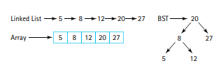
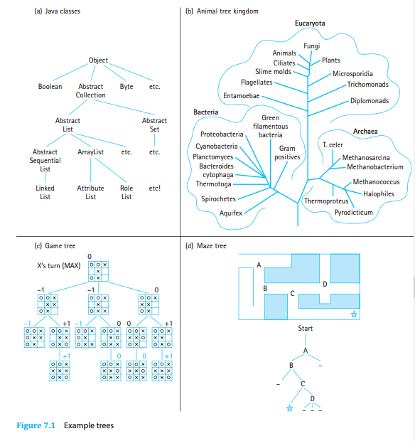
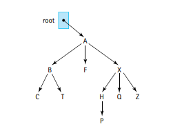

## Author's Note:
I am planning to experiment with the notes a bit in this chapter and will try to follow the textbook very loosely instead of my traditional approach of going through the chapter linearly. As a result these notes are the "abridged" version of the chapter in the truest sense.

For those interested in the long form notes that were common in previous chapters, contact me! I plan on putting those notes in if enough people request for them.

# The Binary Search Tree ADT

The Binary Search Tree (or BST) is a collection that maintains its elements in increasing order while still providing efficent operations to add and remove from the structure.

- A tree of nodes is used to store data as opposed to a linear structure (a la an array, LinkedList, Stack, or Queue).

**Each node references two other nodes, these references are labeled left and right.**

**To add or remove an element, we traverse this tree instead of traversing a linear structure.**

The binary tree combines the fast searching of an array with the fast insertion of a linked list.

- The BST is a specialized version of the Tree structure. Lets first talk about Trees before we jump into BSTs.

---

## Trees

**A tree is a non-linear structure in which each node is capable of having any n number of successor nodes called children. Each of these children can have more children which creates a branching structure!**

Trees were first introduced via UML diagrams that show the hierarchical nature of Java's pre-set classes. But there are other types of trees such as trees that represent nature, game states, or decision trees.

Each node in a tree can be classified via specific terminology.

- Here is a table with some common terminology

| **Definition** | **Meaning** |
|   ----------   |   -------   |
| **Ancestor** | A parent of a node, or that parent's parent, and e.t.c |
| **Children** | The successors of a node are its children |
| **Descendant** | A child of a node, or that child's children, and e.t.c |
| **Level** | The level of a node is its distance from the root (the number of connections between itself and the root) |
| **Height** | The maximum level of the nodes in a tree (with only one node, height = 0 ) |
| **Leaf** | A node that has no children |
| **Interior Node** | A node that is not a leaf node |
| **Root** | The top of node of a tree structure; a node with no parent |
| **Siblings** | Nodes with the same parent |
| **Subtree** | A node and all of its descendents form a subtree that originates (is rooted at) the node |

Here is an example tree:

Here are some statements we can make about the tree:

- The root of the tree is the node A.
- The siblings of node B are nodes F and X.
- The interior nodes of the tree are: A, B, F, X, H
- The leaf nodes of the tree are: C, T, P, Q, Z
- Regardless of the tree, the interior nodes and leaf nodes are disjoint groups.
- The descendants of the node X are: H, P, Q, and Z.
- The ancestors of the node H are: X, A.
- The left subtree of node X has the nodes: H and P.
- The level of the node P is 3.
- The height of the tree is 3.

---

### Tree Traversals

There are many different ways someone can go through a tree since the structure of a tree is not a linear structure.

- Instead of traversing left to right or right to left as one would with an arraylike structure, traversing a tree can be more nuanced and complicated.

Breadth-First vs Depth-First Traversal

Suppose the example tree we were given before:

**A breadth-first traversal of this tree will visit the tree level by level, and print out the nodes on each level from left to right! A breadth-first traversal is also called a level order traversal.**

So for the example tree, we will print the nodes on each level:
- 0th level: A
- 1st level: B, F, X
- 2nd level: C, T, H, Q, Z
- 3rd level: P

**Overall a Breadth-First traversal would print: A, B, F, X, C, T, H, Q, Z, P**

**A depth-first traversal would also go from left to right, but it would first "dig" as deep as possible into the tree by just going left until it hits a leaf node. When hitting the leaf node, we apply the same process of going as far left as possible on its sibling nodes (which may be subtrees). After processing all the siblings, we move up the tree and do the same process for the siblings of the parent node of the previous nodes. After that, we move up one more level and repeat, and so forth! We do this process all the way until the rightmost node of the tree is printed.**

For a Depth-First Traversal I think it helps to have an algorithm:

ALGORITHM
1) Print the path you need to take to get to the left-most node of the tree(minimum value in tree).
2) Apply this same algorithm to the sibling nodes of the node you hit. (Recursion)
3) Get the immeadiate parent of the node you hit, and apply step 1-2 to its sibling nodes. (Recursion)

So for the example tree, we will print as such:

- Printing path to leftmost node of original tree: A, B, C
- Printing path to leftmost node of subtree of node T  (sibling to C) (since T is a single node, we just print it): T
- No sibling nodes left on this level, getting immeadiate parent...
- Printing path to leftmost node of subtree of node F (sibling to B) (since F is a single node, we just print it): F
- Printing path to leftmost node of subtree of node X (sibling to P): X, H, P
- Node P has no siblings, so we get the immeadiate parent...
- Printing path to leftmost node of subtree of node Q (sibling of H) (Since Q is a single node, we just print it): Q
- Printing path to leftmost node of subtree of node Z (sibling of H) (Since Z is a single node, we just print it): Z 

- then we go back to root and see that there is nothing left to traverse.

**Overall a Depth-First traversal would print: A, B, C, T, F, X, H, P, Q, Z**

**There is a more intuitive way of looking at a depth-first traversal.**

- **Because a depth-first traversal is simply a preorder traversal, which we will get to!**

---

Code for Breadth-First Traversal (also called level-order traversal):

Iterative:

        void levelOrder(){
            levelOrder(root);
        }

        private void levelOrder(BSTNode<T> node){

            if (node != null){

                System.out.println(node + " ");

                LinkedQueue<BSTNode<T>> treeQueue = new LinkedQueue<BSTNode<T>>();
                treeQueue.push(root);

                while( !treeQueue.isEmpty() ){
                    
                    BSTNode<T> current = treeQueue.dequeue();
                    System.out.println(current + " ");

                    if (current.left != null) {
                        treeQueue.enqueue(current.left);
                    }

                    if (current.right != null) {
                        treeQueue.enqueue(current.right);
                    }

                }

            }

        }

Recursive:

        void levelOrder(){
            
            for(int i = 0; i < this.height(); i++){

                levelOrder(root, i)

            }

        }

        private void levelOrder(BSTNode<T> node, int level){

            if(root == null){
                return;
            }

            if(level > 0){
                levelOrder(node.getLeft(), level - 1);
                levelOrder(node.getRight(), level - 1)
            } else {
                System.out.println(node.getInfo() + " ");
            }

        }

Code for the Depth-First Traversal (also called preorder traversal):

Iterative:

        void preorder(){
            preorder(root);
        }

        private void preorder(BSTNode<T> node){

            if(node != null){

                LinkedStack<BSTNode<T>> treeStack = new LinkedStack<BSTNode<T>>();
                treeStack.push(root);

                while( !treeStack.isEmpty() ){

                    BSTNode<T> current = treeStack.peek(); // our method is called .top()
                    System.out.println(current.getInfo() + " ");
                    treeStack.pop();

                    if (current.right != null) {
                        treeStack.push(current.right);
                    }
                    
                    if (current.left != null) {
                        treeStack.push(current.left);
                    }

                }

            }

        }
    
Recursive:

        void preorder(){
            preorder(root);
        }

        preorder(BSTNode<T> node){

            if( node != null){
                System.out.println(node.getInfo() + " ");
                preorder(node.getLeft());
                preorder(node.getRight());
            }

        }

