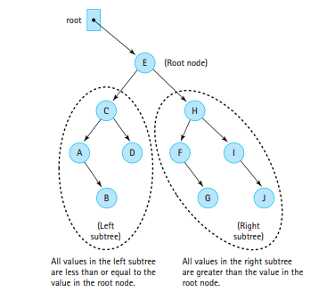

## Author's Note:
I am planning to experiment with the notes a bit in this chapter and will try to follow the textbook very loosely instead of my traditional approach of going through the chapter linearly. As a result these notes are the "abridged" version of the chapter in the truest sense.

For those interested in the long form notes that were common in previous chapters, contact me! I plan on putting those notes in if enough people request for them.

# The Binary Search Tree ADT

The Binary Search Tree (or BST) is a collection that maintains its elements in increasing order while still providing efficent operations to add and remove from the structure.

- A tree of nodes is used to store data as opposed to a linear structure (a la an array, LinkedList, Stack, or Queue).

**Each node references two other nodes, these references are labeled left and right.**

**To add or remove an element, we traverse this tree instead of traversing a linear structure.**

The binary tree combines the fast searching of an array with the fast insertion of a linked list.

- The BST is a specialized version of the Tree structure. Lets first talk about Trees before we jump into BSTs.

---

## Trees

**A tree is a non-linear structure in which each node is capable of having any n number of successor nodes called children. Each of these children can have more children which creates a branching structure!**

Trees were first introduced via UML diagrams that show the hierarchical nature of Java's pre-set classes. But there are other types of trees such as trees that represent nature, game states, or decision trees.

Each node in a tree can be classified via specific terminology.

- Here is a table with some common terminology

| **Definition** | **Meaning** |
|   ----------   |   -------   |
| **Ancestor** | A parent of a node, or that parent's parent, and e.t.c |
| **Children** | The successors of a node are its children |
| **Descendant** | A child of a node, or that child's children, and e.t.c |
| **Level** | The level of a node is its distance from the root (the number of connections between itself and the root) |
| **Height** | The maximum level of the nodes in a tree (with only one node, height = 0 ) |
| **Leaf** | A node that has no children |
| **Interior Node** | A node that is not a leaf node |
| **Root** | The top of node of a tree structure; a node with no parent |
| **Siblings** | Nodes with the same parent |
| **Subtree** | A node and all of its descendents form a subtree that originates (is rooted at) the node |

Here is an example tree:

Here are some statements we can make about the tree:

- The root of the tree is the node A.
- The siblings of node B are nodes F and X.
- The interior nodes of the tree are: A, B, F, X, H
- The leaf nodes of the tree are: C, T, P, Q, Z
- Regardless of the tree, the interior nodes and leaf nodes are disjoint groups.
- The descendants of the node X are: H, P, Q, and Z.
- The ancestors of the node H are: X, A.
- The left subtree of node X has the nodes: H and P.
- The level of the node P is 3.
- The height of the tree is 3.

---

### Tree Traversals

There are many different ways someone can go through a tree since the structure of a tree is not a linear structure.

- Instead of traversing left to right or right to left as one would with an arraylike structure, traversing a tree can be more nuanced and complicated.

Breadth-First vs Depth-First Traversal

Suppose the example tree we were given before:

**A breadth-first traversal of this tree will visit the tree level by level, and print out the nodes on each level from left to right! A breadth-first traversal is also called a level order traversal.**

So for the example tree, we will print the nodes on each level:
- 0th level: **A**
- 1st level: **B, F, X**
- 2nd level: **C, T, H, Q, Z**
- 3rd level: **P**

**Overall a Breadth-First traversal would print: A, B, F, X, C, T, H, Q, Z, P**

**A depth-first traversal would also go from left to right, but it would first "dig" as deep as possible into the tree by just going left until it hits a leaf node. When hitting the leaf node, we apply the same process of going as far left as possible on its sibling nodes (which may be subtrees). After processing all the siblings, we move up the tree and do the same process for the siblings of the parent node of the previous nodes. After that, we move up one more level and repeat, and so forth! We do this process all the way until the rightmost node of the tree is printed.**

For a Depth-First Traversal I think it helps to have an algorithm:

ALGORITHM
1) Print the path you need to take to get to the left-most node of the tree(minimum value in tree).
2) Apply this same algorithm to the sibling nodes of the node you hit. (Recursion)
3) Get the immeadiate parent of the node you hit, and apply step 1-2 to its sibling nodes. (Recursion)

So for the example tree, we will print as such:

- Printing path to leftmost node of original tree: **A, B, C**
- Printing path to leftmost node of subtree of node T  (sibling to C) (since T is a single node, we just print it): **T**
- No sibling nodes left on this level, getting immeadiate parent...
- Printing path to leftmost node of subtree of node F (sibling to B) (since F is a single node, we just print it): **F**
- Printing path to leftmost node of subtree of node X (sibling to P): **X, H, P**
- Node P has no siblings, so we get the immeadiate parent...
- Printing path to leftmost node of subtree of node Q (sibling of H) (Since Q is a single node, we just print it): **Q**
- Printing path to leftmost node of subtree of node Z (sibling of H) (Since Z is a single node, we just print it): **Z**

- then we go back to root and see that there is nothing left to traverse.

**Overall a Depth-First traversal would print: A, B, C, T, F, X, H, P, Q, Z**

**There is a more intuitive way of looking at a depth-first traversal.**

- **Because a depth-first traversal is simply a preorder traversal, which we will get to!**

---

Code for Breadth-First Traversal (also called level-order traversal):

Iterative:

        void levelOrder(){
            levelOrder(root);
        }

        private void levelOrder(BSTNode<T> node){

            if (node != null){

                System.out.println(node + " ");

                LinkedQueue<BSTNode<T>> treeQueue = new LinkedQueue<BSTNode<T>>();
                treeQueue.push(root);

                while( !treeQueue.isEmpty() ){
                    
                    BSTNode<T> current = treeQueue.dequeue();
                    System.out.println(current + " ");

                    if (current.left != null) {
                        treeQueue.enqueue(current.left);
                    }

                    if (current.right != null) {
                        treeQueue.enqueue(current.right);
                    }

                }

            }

        }

Recursive:

        void levelOrder(){
            
            for(int i = 0; i < this.height(); i++){

                levelOrder(root, i);

            }

        }

        private void levelOrder(BSTNode<T> node, int level){

            if(root == null){
                return;
            }

            if(level > 0){
                levelOrder(node.getLeft(), level - 1);
                levelOrder(node.getRight(), level - 1);
            } else {
                System.out.println(node.getInfo() + " ");
            }

        }

Code for the Depth-First Traversal (also called preorder traversal):

Iterative:

        void preorder(){
            preorder(root);
        }

        private void preorder(BSTNode<T> node){

            if(node != null){

                LinkedStack<BSTNode<T>> treeStack = new LinkedStack<BSTNode<T>>();
                treeStack.push(root);

                while( !treeStack.isEmpty() ){

                    BSTNode<T> current = treeStack.peek(); // our method is called .top()
                    System.out.println(current.getInfo() + " ");
                    treeStack.pop();

                    if (current.right != null) {
                        treeStack.push(current.right);
                    }
                    
                    if (current.left != null) {
                        treeStack.push(current.left);
                    }

                }

            }

        }
    
Recursive:

        void preorder(){
            preorder(root);
        }

        preorder(BSTNode<T> node){

            if( node != null){
                System.out.println(node.getInfo() + " ");
                preorder(node.getLeft());
                preorder(node.getRight());
            }

        }

---

## Binary Search Trees

Binary Search Trees are specialized binary trees that fulfill a certain property for any given node in the tree.

**The Binary Search Property:**

**For any given node in a BST...**
- **Every node in the node's left subtree must have a key less than or equal to its own key.**
- **Every node in the node's right subtree must have a key greater than its own key.**

**This property is what separates a BST from a normal tree.**

Below is a comparison between a traditional binary tree and a BST:

For the BST, note that if you pick any node, the binary search property still holds!

- If we look at the node with a value of C, the values in its left subtree (A and B) are all less than or equal to its own value. Furthermore, the values in its right subtree (just D) are greater than its own value.

- We could do this for any node that has children! For child nodes, this property is meaningless since lead nodes do not have subtrees.

- **However, for all non-leaf nodes the binary search property holds which is what matters!**

---

### Binary Tree Traversals

Binary Tree traversals are basically specialized tree traversals that take advantage of the recursive structure of trees. 

- 1 Tree can be composed of many subtrees!
- Each tree and subtree is defined by its root, and that root's left and right subtrees!

We can use recursion to print out the left subtree, root, and right subtree in different orders.

3 Types of Traversals:

- Preorder (Root, Left, Right)
- Inorder (Left, Root, Right)
- Postorder (Left, Right, Root)

Each traversal is most intuitively understood using recursion!

- For each traversal, the user will call a version of the method that has no parameters, but internally this no-parameter public method will call a private method that accepts a node. The initial call to this method will pass the root node!

The traversals can be written in a complex manner or a more simplistic manner depending on how you define a base case.

- Many people would conclude that a base case should occur when the passed node has no children. Because if the passed node has no children then you could just print the node and end recursion.
- **However, with the approach above, what if the first node passed was null? Then how would you check that? Well you could add a null checking if statement before the main cases, but that's too much code!**

- **Instead, our base cases will occur when the node passed is a null reference! Since our traversals will keep calling getLeft() and getRight() over and over, they will eventually all end up with null reference calls and which point the recursion will end!**

---

Code for the traversals:

Preorder traversal:

        protected void preOrder(){
            preOrder(root);
        }

        private void preOrder(BSTNode<T> node){

            if( node != null){

                System.out.println(node + " ");
                preOrder(node.getLeft());
                preOrder(node.getRight());

            }

        }

Inorder traversal:

        protected void inOrder(){
            inOrder(root);
        }

        private void inOrder(BSTNode<T> node){

            if( node != null){

                inOrder(node.getLeft());
                System.out.println(node + " ");
                inOrder(node.getRight());

            }

        }

Postorder traversal:

        protected void postOrder(){
            postOrder(root);
        }

        private void postOrder(BSTNode<T> node){

            if( node != null){

                postOrder(node.getLeft());
                postOrder(node.getRight());
                System.out.println(node + " ");

            }

        }
        

---

## The BST Interface

Apart from the binary tree traversals the user should also be able to perform the same operations on a Binary tree that they perform on a typical collection. 

- The Binary Search Tree interface will extend the CollectionInterface which effectively means that any class that implements the BSTInterface will also have to satisfy the contract requirements of the Collection interface.

- The BST interface will also enforce the ability to create an iterator object via a getIterator() method. However, we will also extend the Iterable interface which forces us to create a method called iterator().

- **The iterator() and getIterator(Traversal orderType) methods are inherently very similar. The iterator method is just an easy way to create an iterator w/o having to specify a traversal.**

- **In the code, the iterator() method just calls and returns getIterator(Traversal.Inorder). This is because the inorder traversal is considered the default traversal for a BST.**

The code for the interface:

        public interface BSTInterface<T> extends CollectionInterface<T>, Iterable<T>{

            public enum Traversal {Inorder, Preorder, Postorder};
            // This enum class is used to specify the traversal order for the iterator.
            // The user will have to create and pass one of the values as an object of Traversal class.

            T min();
            // If the BST is not empty this method returns the smallest element in the tree.
            // Otherwise if the tree is empty, this method returns a null reference.

            T max();
            // If the BST is not empty this method returns the largest element in the tree.
            // Otherwise if the tree is empty, this method returns a null reference.

            public Iterator<T> getIterator(Traversal orderType);
            // Creates and returns an iterator object which contains elements of tree ordered
            // based on the specified traversal. The iterator object is a snapshot of the tree,
            // based on the elements of the tree that were present when the iterator was called.
            // Therefore if we manipulate the tree after creating an iterator, those changes will
            // not be reflected in the iterator object!

        }

- **Keep in mind that the CollectionInterface has its own set of requirements which are hidden here but include: boolean isFull(), boolean isEmpty(), int size(), boolean add(T element), T get(T target), boolean contains(T target), and boolean remove(T target).**

---

## Implementation: The BSTNode

A Binary Tree, and consequently, a BST, is made up of several nodes which have 3 core components:

1) **A link (BSTNode reference) to a "left" node.**
2) **A link (BSTNode reference) to a "right" node.**
3) **A field to store its own information, often called value or info!**

Rememeber that left and right are just names we are giving to the references to help up visualize the tree, but they could in theory be called anything!

- **When initializing a BST Node the info is given in the constructor but the links (left and right) start out as null references.**

- setLeft() and setRight() are transformer (or setter) methods that set references based on the node reference passed into them.

- getLeft() and getRight() are observer (or getter) methods that get and return the references to the left or right nodes to the calling class.

- setInfo() and getInfo() are methods that set or get the info field of the node they are being called on.

Code for a BSTNode (with generics involved for the type of the info field!):

        public class BSTNode<T>{

            private T info;
            private BSTNode<T> left;
            private BSTNode<T> right;

            public BSTNode(T info){

                this.info = info;
                left = right = null;

            }

            public void setInfo(T info) {
                this.info = info;
            }

            public T getInfo() {
                return info;
            }

            public void setLeft(BSTNode<T> link) {
                left = link;
            }

            public void setLeft(T link) {
                left = new BSTNode<T>(link);
            }

            public void setRight(BSTNode<T> link) {
                right = link;
            }

            public void setRight(T link) {
                right = new BSTNode<T>(link);
            }

            public BSTNode<T> getLeft() {
                return left;
            }

            public BSTNode<T> getRight() {
                return right;
            }

        }

---

## Implementation: Observers

---

### The size() method

The size() method can be implemented iteratively or recursively. But we favor the recursive implementation because it is far simpler to code and is more intuitive.

- There is not a major drawback nor a major benefit regarding the speed of either implementation, so we just choose the one that is easier to code.

Recursive Approach:
1) If the node is not null then call recSize on the left and right subtrees. The returned value should be the sum of those recursive calls and 1, since the 1 represents counting the current node we are visiting.
2) If the node is null, then return 0 to end recursion and represent the lack of a node.

Code for recursive approach:

        int recSize(){
            return recSize(root);
        }

        private int recSize(BSTNode<T> node){

            if(node == null){
                return 0;
            } else{
                return recSize(node.getLeft()) + recSize(node.getRight()) + 1;
            }

        }

Iterative approach (not favored but if you are curious):
1) Create a stack of nodes and add the root to it initially (given the root is not null).
2) After pushing the root, enter a while loop which will end when the stack is empty.
3) In the loop, assign the top of the stack to a placeholder (currentNode maybe), and then pop the top of the stack.
4) Increase the counter variable to indicate 1 more node being finished processing.
5) After, still in the loop, push in the left reference of the placeholder node onto the stack (if it is not null).
6) After, still in the loop, push in the right reference of the placeholder node onto the stack (if it is not null).
7) After the loop, each node that had to be processed will have been processed (since the loop will only become empty after processing all leaf nodes and their prior ancestors). The counter will contain the size.
8) Return the counter (if the root was null, then counter should be equal to 0 and none of the prior steps would have happened).

Code for iterative approach:

        public int size(){

            int count = 0;
            if (root != null){
                
                LinkedStack<BSTNode<T>> treeStack = new LinkedStack<BSTNode<T>>;
                BSTNode<T> current;
                treeStack.push(root);

                while(){
                    current = treeStack.top();
                    treeStack.pop();
                    count++;

                    if(current.getLeft() != null){
                        treeStack.push(current.getLeft());
                    }
                    if(current.getRight() != null){
                        treeStack.push(current.getRight());
                    }

                }

            }

            return count;

        }

---

### The contains() and get() operations!

- The contains and get operations are very similar but not identical.

- Both operations traverse the binary search tree in an identical manner to attempt to locate the specified node!

- Both operations have a public method that simply requires the target element but have an internal, private, method that accepts the target and a node in order to perform the bulk of the work through recursion.

- **The big difference is that the contains() method returns a boolean to indicate if the element was found or not. The get() method returns the found element itself rather than a true or false value.**

Recursive traversal of a binary search tree is possible due to the binary search property:

- the left subtree of a given node must contain values smaller than or equal to the node's, whereas the right subtree must contain values greater than the node's value.

Recursive approach:

- **If our target is smaller than the value at the node, we simply call our searching method on the left subtree.**
- **If our target is greater than the value at the node, we call our searching method on the right subtree.**
- **If the node we are at is equal to the target we return true / false for contains() or the node itself for the get() method.**
- **If we reach a null node then the search was unsuccessful, since we traversed the tree properly but bottomed out somewhere. The "location" where we bottomed out is where the node should be inserted or should have been placed *if* the tree contained the node.**

Code for recursive contains():

        public boolean contains(T target) {

            return recContains(target, root);

        }

        private boolean recContains(T target, BSTNode<T> node) {

            if (node == null) { // BASE case, target node not found

                return false;

            } else if (comp.compare(target, node.getInfo()) < 0) {

                // If the target is lesser than the info of the current node...
                // RECURSIVE CASE, search the left subtree of the current node.
                return recContains(target, node.getLeft());

            } else if (comp.compare(target, node.getInfo()) > 0) {

                // If the target is greater than the info of the current node...
                // RECURSIVE CASE, search the right subtree of the current node.
                return recContains(target, node.getRight());

            } else { // BASE case, target node found!

                return true;

            }

        }

Code for recursive get():

        public T get(T target) {

            return recGet(target, root);

        }

        private T recGet(T target, BSTNode<T> node) {

            if (node == null) { // BASE case, target node not found

                return null;

            } else if (comp.compare(target, node.getInfo()) < 0) {

                // If the target is lesser than the info of the current node...
                // RECURSIVE CASE, search the left subtree of the current node.
                return recGet(target, node.getLeft());

            } else if (comp.compare(target, node.getInfo()) > 0) {

                // If the target is greater than the info of the current node...
                // RECURSIVE CASE, search the right subtree of the current node.
                return recGet(target, node.getRight());

            } else { // BASE case, target node found!

                return node.getInfo();

            }

        }

---

### The isEmpty() and isFull() operations!

- We know if a BST is empty if the original reference, i.e. the root node, of any given tree is null. If the root is null, then the tree has not even been formed yet!

- We know if a BST is full... well it is a collection of nodes, so it really can never be full. Just like other structures composed of nodes (LinkedList, LinkedStack, LinkedQueue, e.t.c ) thwew is no capacity limit on the number of nodes that can be part of a BST.

Code for isEmpty() and isFull() methods:

        public boolean isFull() {
            return false;
        }

        public boolean isEmpty() {
            return (root == null);
        }

---

### The min() and max() operations!

- These observer methods are explicitly part of the BSTInterface and are specific for BST implementations (in other words we did not see them when dealing with collections).

- **Remember that a BST, even if it does not look like it, is an ordered structure**

- In any correctly 

---
